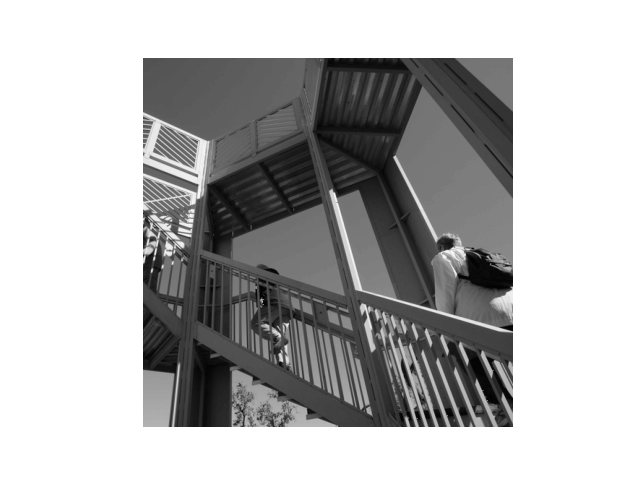
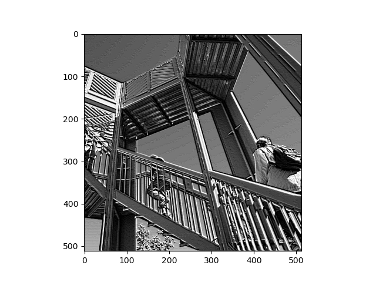
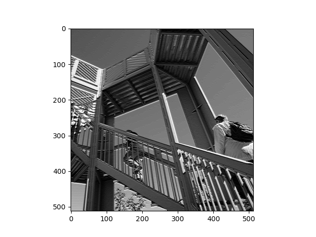
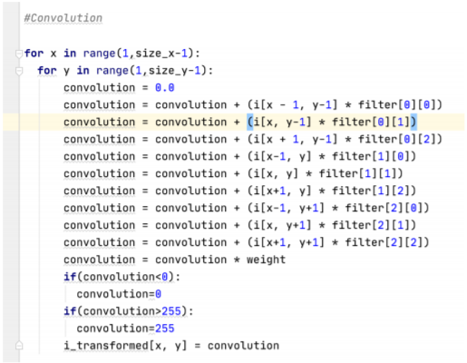
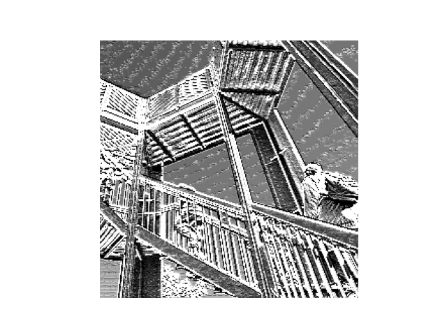
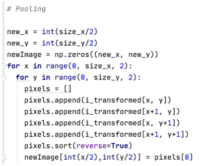

**A. Last week you did an exercise where you manually applied a 3x3 array as a filter to an image of two people ascending an outdoor staircase.**  

   **1. Modify the existing filter and if needed the associated weight in order to apply your new filters to the image 3 times.  Plot each result, upload them to your response, and describe how each filter transformed the existing image as it convolved through the original array and reduced the object size.**  
   
   
   
   
   
   
   
   
   
   
   

   **2. What are you functionally accomplishing as you apply the filter to your original array (see the following snippet for reference)?**  

   **3. Why is the application of a convolving filter to an image useful for computer vision?**  

   **4. Stretch goal: instead of using the misc.ascent() image from scipy, can you apply three filters and weights to your own selected image?  Again describe the results.**

**B. Another useful method is pooling.**
   **1. Apply a 2x2 filter to one of your convolved images, and plot the result.**  
   
   
   
   **2. In effect what have you accomplished by applying this filter?**  

   **3. Can you determine from the code which type of pooling filter is applied, and the method for selecting a pixel value (see the following snippet)?**  
     

   **4. Did the result increase in size or decrease?  Why would this method be useful?**

   **5. Stretch goal:  again, instead of using misc.ascent(), apply the pooling filter to one of your transformed images.**

**C. The lecture for today (Coding with Convolutional Neural Network) compared the application of our previously specified deep neural network with a newly specified convolutional neural network.  Instead of using the fashion_MNIST dataset, use the mnist dataset (the hand written letters) to train and compare your DNN and CNN output.**      

   **1. Were you able to improve your model by adding the Conv2D and MaxPooling2D layers to your neural network?  Plot the convolutions graphically, include them in your response and describe them.**

   **2. Edit the convolutions by changing the 32s to either 16 or 64 and describe what impact this had on accuracy and training time.**  

   **3. What happens if you add more convolution layers?**
