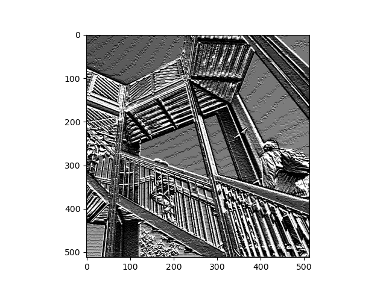
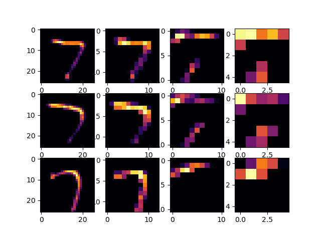

**A. Last week you did an exercise where you manually applied a 3x3 array as a filter to an image of two people ascending an outdoor staircase.  Modify the existing filter and if needed the associated weight in order to apply your new filters to the image 3 times.  Plot each result, upload them to your response, and describe how each filter transformed the existing image as it convolved through the original array and reduced the object size.  What are you functionally accomplishing as you apply the filter to your original array (see the following snippet for reference)?  Why is the application of a convolving filter to an image useful for computer vision?**
   
***The snippet for reference is the following:***

  

***The image below depicts the original version of two people ascending the outdoor staircase:***

   
   
   
*    A convolving filter looks at each pixel and its surrounding neighbors. It then multiplies the specified weights in the filter array by the values of each scanned pixel.  The size of the array determines how many pixels the filter will scan.  In this case, the 3x3 array will scan the current pixel, plus the three pixels above and below it, in addition to the three pixels to the right and left of it.  In other words, the filter will be applied to a 3x3 grid of pixels like the one shown in the picture below.  It will then compute the dot product of the red and gray-scale tables shown below, and the result will become the new value for the current pixel.  The if-statements in the reference snippet above ensure that the dot product stays between 0 and 255.  The process repeats in this way as it loops through each pixel.  Ultimately, transforming the image using a convolving filter reduced the size of the image object because there must be a one pixel buffer to ensure every weight in the filter array is multiplied by a pixel value.  As such, the outer edges of the image are not processed because there must be 8 directly adjacent pixels to the current pixel.

   
*   The image below depicts the first filter on the image.  I used filter = [ [-1, 0, -2], [0.5, 4.5, -1.5], [1.5, 2, -3]], with weight = 1 because the values in the filter add up to 1.  The values in the filter would have been multiplied by the value of the image's pixels as shown in the table below, where the current pixel is labeled as (x,y).  Then, these products were summed together, multiplied by the weight of 1, and the result became the new value of the current pixel at (x,y).  This filter increased the contrast of the image by brightening lighter colors and further darkening darker colors.  It also sharpened the edges, yielding a much more crisp picture of the staircase.
   
   
     
   
   
    
   |                                      |                                            |                                      | 
   | ------------------------------------ | ------------------------------------------ | ------------------------------------ |
   |    -1 * value of pixel at (x-1,y+1)  |    0.5 * value of pixel at (x,y+1)         |   1.5 * value of pixel at (x+1,y+1)  |
   |     0 * value of pixel at (x-1,y)    |    4.5 * value of current pixel at (x,y)   |     2 * value of pixel at (x+1,y)    |
   |    -2 * value of pixel at (x-1,y-1)  |    -1.5 * value of pixel at (x,y-1)        |     -3* value of pixel at (x+1,y-1)  |
   
   
   
   
*   I then applied a second filter to the original image, as shown below.  I used filter = [ [-0.55, 0, -3], [10, 2, -8], [2, 2, -4]], with weight = 2.22 because the values in the filter add up to 0.45.  Like above, the values in the filter would have been multiplied by the value of the image's pixels as shown in the table below.  Then, these products were summed together, multiplied by the weight of 2.22, and the total became the new value of the current pixel at (x,y).  This filter greatly increased the contrast of the image by heavily brightening lighter colors.  Consequently, the filter effectively converted the image from gray-scale to black-and-white.  Interestingly, this filter also produced wavy lines across the sky.
   
   
   
   
   
   
   |                                         |                                            |                                       |   
   | --------------------------------------- | ------------------------------------------ | ------------------------------------- |   
   |    -0.55 * value of pixel at (x-1,y+1)  |    10 * value of pixel at (x,y+1)          |      2 * value of pixel at (x+1,y+1)  |
   |        0 * value of pixel at (x-1,y)    |     2 * value of current pixel at (x,y)    |      2 * value of pixel at (x+1,y)    |
   |       -3 * value of pixel at (x-1,y-1)  |    -8 * value of pixel at (x,y-1)          |     -4 * value of pixel at (x+1,y-1)  |
   
 
 
 
*   Lastly, I applied a third filter to the image and attached it below.  This time, I used filter = [ [-5, 5, 0], [0, -2, 3], [1, -20, 25]], with weight = 0.143 because the values in the filter add up to 7.  The values in the filter would have been multiplied by the value of the image's pixels as shown in the table below.  Then, these products were summed together, multiplied by the weight of 0.143, and the total became the new value of the current pixel at (x,y).  This filtered image appears quite similar to the original image, as the third filter only slightly sharpened the edges (which is most visible in the leaves of the tree toward the bottom of the image.  The image's contrast was also increased by lightly brightening the lighter colors in the image.
   
   
   
   
   
   
   |                                      |                                           |                                       |
   | ------------------------------------ | ----------------------------------------- | ------------------------------------- |
   |    -5 * value of pixel at (x-1,y+1)  |    0 * value of pixel at (x,y+1)          |      1 * value of pixel at (x+1,y+1)  |
   |     5 * value of pixel at (x-1,y)    |   -2 * value of current pixel at (x,y)    |    -20 * value of pixel at (x+1,y)    |
   |     0 * value of pixel at (x-1,y-1)  |    3 * value of pixel at (x,y-1)          |     25 * value of pixel at (x+1,y-1)  |

 
*    Convolving filters are very useful for computer vision because they process and extract the important features from the image.  Thus, the model requires less information to classify and differentiate images because it can focus its decision-making on the presence of these key details.  As a result, it requires less space and time to run the model.  Plus, since the convolving layers narrow down the information that is passed to the final Dense layers, the Dense layers are able to make more accurate predictions because they have more refined data.  Convolving filters are particularly effective at allowing the computer to detect edges.  

---
---

**B. Another useful method is pooling.  Apply a 2x2 filter to one of your convolved images, and plot the result.  In effect what have you accomplished by applying this filter?  Can you determine from the code which type of pooling filter is applied, and the method for selecting a pixel value (see the following snippet)?  Did the result increase in size or decrease?  Why would this method be useful?**  
  
***The snippet for reference is the following:***

***The image below is a copy of the second convolved image from Part A, prior to pooling**

*    The image below depicts the pooled version of the picture to which the second convolving filter was applied (as previously shown in Part A of this response, which I also re-attached just above this sentence).  The image decreased slightly in size, but the most important features were preserved.  The contrast was also increased, as the lighest colors were practically reduced to white and the darkest colors were slightly brightened too.  When previously applying the second filter, I mentioned that the image had been converted from gray-scale to black-and-white, but this is even more true after the 2x2 pooling filter was applied.

   

*    The code from the reference snippet above utilizes a 2x2 MAX pooling filter, which selects the largest pixel value from a set of values containing the current pixel value and the values of its most adjacent neighbors to its immediate right, bottom, and bottom-right.  In other words, the filter will scan a 2x2 grid of pixels, like the one shown below, to find the highest value among them.  This maximum value will become the new current pixel value in the pooled image.  The process will repeat for every other pixel in every other row of the provided image.  Consequently, the resulting image will be reduced to 1/4 of the original size. 

     Although the size is decreased, the important features found from the convolving filter are preserved in the new image.  This method is useful because it decreases the amount of information required to classify and differentiate images by allowing the model to focus its decision-making on the presence of these distinct features found from convolving the images.  Consequently, less space and time is required to run the models.

     
     
*    I also created a table that demonstrates the process more generally below, with the current pixel labeled as (x,y).  The pooling filter will iterate through each pixel labeled in the cells below and select the maximum of these values to be the value of the pixel in the resulting image of reduced size.  For example, the filter will first select the largest value among pixels (x,y), (x+1,y), (x,y-1), and (x+1,y-1).  It will then use this value for the top left pixel in the resulting image.  

   |                                                                |                                                                            |
   | -------------------------------------------------------------- | -------------------------------------------------------------------------- |
   |    Value of pixel at (x,y); (x+2,y); (x,y-2); (x+2,y-2)        |    Value of pixel at (x+1,y); (x+3,y); (x+1,y-2); (x+3,y-2)                |
   |    Value of pixel at (x,y-1); (x+2,y-1); (x,y-3); (x+2,y-3)    |    Value of current pixel at (x+1,y-1); (x+3,y-1); (x+1,y-3); (x+3,y-3)    |
   

---
---

**C. The lecture for today (Coding with Convolutional Neural Network) compared the application of our previously specified deep neural network with a newly specified convolutional neural network.  Instead of using the fashion_MNIST dataset, use the mnist dataset (the hand written digits) to train and compare your DNN and CNN output.  Were you able to improve your model by adding the Conv2D and MaxPooling2D layers to your neural network?  Plot the convolutions graphically, include them in your response and describe them.  Edit the convolutions by changing the 32s to either 16 or 64 and describe what impact this had on accuracy and training time.  What happens if you add more convolution layers?**

*    Adding the Conv2D and MaxPooling2D layers to my neural network increased the accuracy value of the model by just over 0.1.  While the dense neural network (DNN) predictions were very accurate, with a value of approximately 0.98, the convolutional neural network (CNN) predictions had a slightly higher accuracy value of approximately 0.99.  The CNN's heightened accuracy is even more strongly supported by its lower loss value than the DNN.  There was just under a 2.5x difference between the two, with the CNN's loss equating to approximately 0.029 and the DNN's loss equating to about 0.071.

*    The image below graphically depicts the convolutions and poolings for three examples of the digit 7, which were extracted from the testing images of the mnist dataset.  Each row of the attached image depicts a different picture of the digit 7 from the testing set.  More specifically, the first row depicts the 7 stored at index 0, the second row depicts the 7 stored at index 17, and the 7 stored at index 26 of the testing images.  Each column represents these images after they pass through a Conv2D of MaxPooling2D layer of the neural network.  In other words, the first column depicts each of the three images after passing through the first Conv2D layer.  Then, the second column depicts each of the images after passing through the first MaxPooling2D layer.  Lastly, the third column depicts the three digits after passing through the second/final Conv2D layer and the fourth column depicts the three digits after passing through the second/final MaxPooling 2D layer of the network.  By plotting these results, we can see the common features of the digit 7 being highlighted by the convolving filters in the first and third column.  These features allow the model to distinguish between a 7 and the other digits between 0 and 9.  Across the second and fourth columns, we then see the pixels getting larger as the pooling filters reduce the size of the image (while still keeping the highlighted features intact).

     

*    After editing the convolutions by changing the number of filters in the initial layer from 32 to 16, the training time decreased quite significantly from an average duration of 30.4 seconds per epoch to an average duration of 17.8 seconds per epoch.  While the final accuracies remained quite similar at approximately 0.9905, the loss slightly increased when decreasing the number of filters from 32 to 16.  With the number of filters in the first layer set to 32, the loss was approximately 0.029; when reset to 16, the loss was approximately 0.031.  This indicates that the model with 32 filters in the first convolution layer is slightly more accurate than the model with 16 filters in the first convolution layer, as a more accurate model has a lower loss.  Based on these results, I would predict that setting the first convolution layer's number of filters to 64 would further increase the accuracy of the model in predicting the identity of a handwritten digit.

*    I decided to add a third convolution after the final pooling layer.  However, this did not seem to produce a better model than the orginal CNN.  Not only did adding the additional convolution layer greatly increase the training time to an average duration of 43 seconds per epoch, but it also slightly decreased the accuracy to 0.9883 (the previous accuracy was 0.9905) and increased the loss to 0.041 (the previous loss was 0.029).  I then added a third pooling layer.  This further increased the training time to an average duration of 55.2 seconds per epoch.  In addition, the model's loss increased slightly to 0.042 and the accuracy decreased slightly to 0.9877.  Based on these results, I would predict that adding additional convolution and pooling layers would not enhance the model's performance and, in fact, would likely impede the model's performance.
