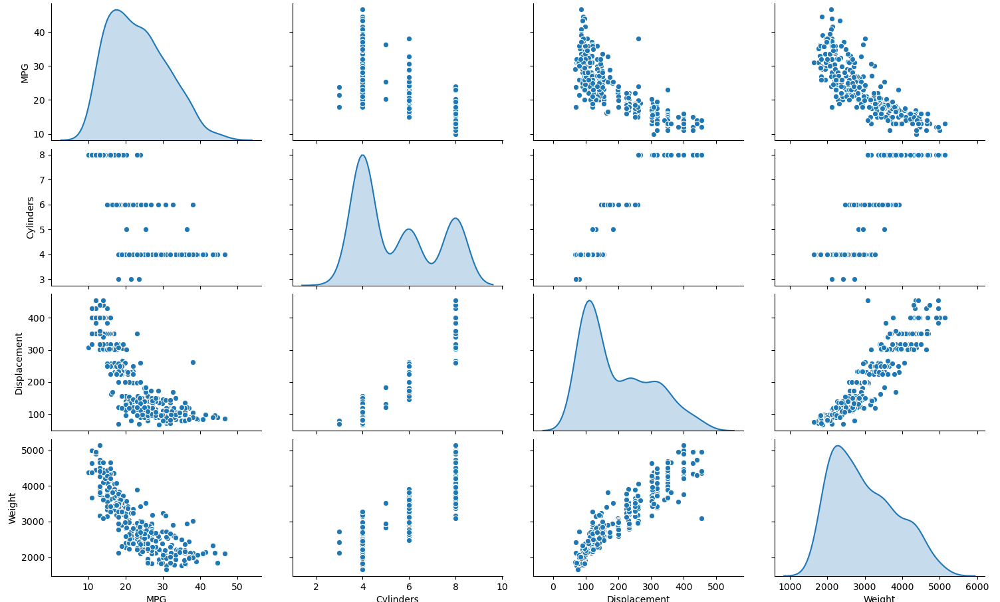
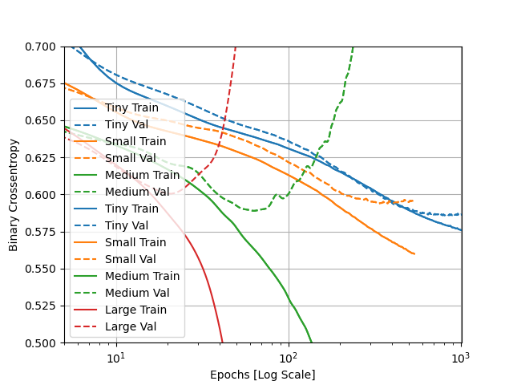

**A. Convolutional horses and humans**

  **1. Describe the ImageDataGenerator() command and its associated argument.  What objects and arguments do you need to specify in order to flow from the directory to the generated object?  What is the significance of specifying the target_size = as it relates to your source images of varying sizes? What considerations might you reference when programming the class mode = argument?  How much difference exists when applying the ImageDataGenerator() and .flow_from_directory() commands to the training and test datasets?**
  
*    The ImageDataGenerator() command allows us to use image data generators.  Its associated argument is called rescale, and it normalizes the images by the factor specified.  In the case of convolutionals with images of horses and humans, rescaling by dividing each byte value by 250 allows each byte's value to fall between 0 and 1.  
     
     To generate the training data, you need to use .flow_from_directory() with the training data generator created using ImageDataGenerator().  Likewise, to generate the testing data, you need to repeat this with the testing data generator created using ImageDataGenerator().  You then need to pass an argument to the .flow_from_directory() command that specifies which directory the data comes from.  For the training set, this would be your training directory; for the testing set, this would be your testing directory.  
     
     Whether generating the training data or testing data, you then need to specify the size of the images you would like to provide to the neural network.  This argument is called "target_size," and the images will all be fed through the neural network as that size, no matter what their original size happened to be.  Consequently, it is important to set an appropriate size for your image.  If you set a size that is too small for your images, you could cut off important features.  On the other hand, if you set a size that is too large for your images, you could be wasting valuable space in memory.  
     
     After that, you need to provide the batch size argument, which specifies how many training images to be loaded in a group together.  Lastly, you need to set the class mode argument.  When setting a value for this argument, it is important to consider the dimensionality of the array of class labels.  If the array is two-dimensional, it would be best to use the categorical class mode.  Otherwise, if the array is one-dimensional, it is also important to consider the number of class labels.  If there are just two options (either 0 or 1), then it would be best to use the binary class mode.  If there are more than two, it is best to use the sparse class mode.  

     All of the arguments listed above need to be specified when applying the ImageDataGenerator() and .flow_from_directory() commands, both to the training dataset *and* the testing dataset.  The argument to ImageDataGenerator() is "rescale" and the arguments to .flow_from_directory() include the directory name, "target_size," "batch_size," and "class_mode."  The only difference between the application to the training dataset versus the test dataset is that you would be using two distinct directories that refer to the the training images and testing images, respectively.  Likewise, the data generators would have different names to indicate that one is to be used for training data, while the other is to be used for testing data.

  **2. Describe the model architecture of the horses and humans CNN as you have specified it.  Did you modify the number of filters in your Conv2D layers?  How do image sizes decrease as they are passed from each of your Conv2D layers to your MaxPooling2D layer and on to the next iteration?  Finally, which activation function have you selected for your output layer?  What is the significance of this argument’s function within the context of your CNN’s prediction of whether an image is a horse or a human?  What functions have you used in the arguments of your model compiler?**

***I have attached a table depicting the model architecture of my horses and humans CNN below:***

*     The model architecture of my horses and humans CNN includes three Conv2D layers, three MaxPooling2D layers, a flattening layer, and two final Dense layers.  The first convolving (i.e., Conv2D) layer contains 16 filters, the second contains 32 filters, and the last includes 64 filters.  All three convolving layers also use 3x3-sized filters, and the first layer indicates that the input to the model will be a 300x300-sized image with a 3-byte color depth.  The number of filters increases in each of these layers as the size of the image decreases.  
      
      After passing through a convolving layer, the image loses its side borders.  Thus, the size of the image decreases by 2, in both dimensions, each time it passes through a Conv2D layer.  This can be seen in the table above, where the picture decreased in size from 300x300 to 298x298 after passing through the initial Conv2D layer of the neural network.  The pooling (i.e., MaxPooling2D) layers "pool" together 2x2 chunks of pixels from the images that pass through them.  In effect, the image is  decreased by a quarter of its previous size each time it passes through a pooling layer.  This is because each of the image's dimensions shrink by half.  
      
      After passing through the flattening layer, the data will be stored in a one-dimensional array.  The Dense layers then determine the probability that the image portrays a human or a horse.  

      (I will be adding where I discuss modifying the number of filters in the Conv2D layers shortly).

      The model utilizes the relu activation function in all of the convolving layers, as well as the first Dense layer.  Relu ensures there are no negative neural outputs by setting all negative output values equal to 0.  It is important to do this because negative outputs in one layer of the neural network could impede the accuracy of the model's results by canceling out positive outputs in subsequent layers.  
      
      The output layer, which is also the final Dense layer, uses the sigmoid activaton function.  The sigmoid function yields a single output value between 0 and 1, where a '0' means that an object definitely belongs to one class and a '1' means that an object definitely belongs to the other class.  Values that fall between 0 and 1 indicate that the model is less sure of its classification decision.  In this case, a '0' indicates the model is completely confident in its decision that the image depicts a horse.  On the other hand, a '1' indicates the model is completely confident that the image portrays a human.  Since this is a binary classification problem and the sigmoid activation function is being used, the last layer is allowed to contain only one neuron.  
      
      Within the model's compiler, there are three arguments: loss, optimizer, and metrics.  Binary Cross-Entropy is provided as the function for the "loss" argument, as the model is using binary classification in order to classify an object as one of two things: a human or a horse.  The RMSprop function is provided for the "optimizer" argument, with an initial learning rate of 0.001.  RMSprop behaves similarly to the Adam optimizer, which we use often in this class, in that it adapts its learning rate based upon the status of various values in the model after each epoch, such as the loss value.  Lastly, the metrics argument uses the accuracy function, which records the accuracy of the model during training.

---
---

**B. Regression**

  **1. Using the auto-mpg dataset (auto-mpg.data), upload the image where you used the seaborn library to pairwise plot the four variables specified in your model.  Describe how you could use this plot to investigate the co-relationship amongst each of your variables.  Are you able to identify interactions amongst variables with this plot?  What does the diagonal access represent?  Explain what this function is describing with regarding to each of the variables.**
  
  

  **2. After running model.fit() on the auto-mpg.data data object, you returned the hist.tail() from the dataset where the training loss, MAE & MSE were recorded as well as those same variables for the validating dataset.  What interpretation can you offer when considering these last 5 observations from the model output?  Does the model continue to improve even during each of these last 5 steps?  Can you include a plot to illustrate your answer?**  
  
  
  
  **Stretch goal: include and describe the final plot that illustrates the trend of true values to predicted values as overlayed upon the histogram of prediction error.**

---
---

**C. Overfit and Underfit**

  **1. What was the significance of comparing the 4 different sized models (tiny, small, medium, large)?  Can you include a plot to illustrate your answer?**
  
  *   The different sized models were compared to show the extent of over- and under-fitting when the number of parameters determined by the model (i.e., the model's capacity) are altered.  The greater the number of parameters that can be learned, the more overfit the model tends to be.  This is because the model is better at mapping to the training set than it is  at generalizing predictions to data it has never seen before.  On the other hand, the fewer the parameters to be learned, the more underfit the model tends to be.  This is because the model can't really map well to the training data, which also causes the model to be similarly less accurate at generalizing to data it hasn't seen before.  The tiny model was the most underfit, with both a low training and testing/validation accuracy (I will be inserting the respective values soon).  The small model was an improvement, but it was still underfit, with both a low training and testing accuracy.  The medium model improved greatly on its training accuracy, but the testing accuracy remained quite similar to that of the tiny model.  Thus, the medium model was slightly overfit.  The large model achieved perfect accuracy on the training data and the testing accuracy slightly improved from the medium model, but also stayed similar to that of the tiny model.  Consequently, the large model was the most overfit.  As such, the medium model would likely be the best option for this dataset, as it increases the training accuracy without being quite as overfit as the large model.  I have attached a plot portraying the models' training and testing accuracies below. 
  
  
   
