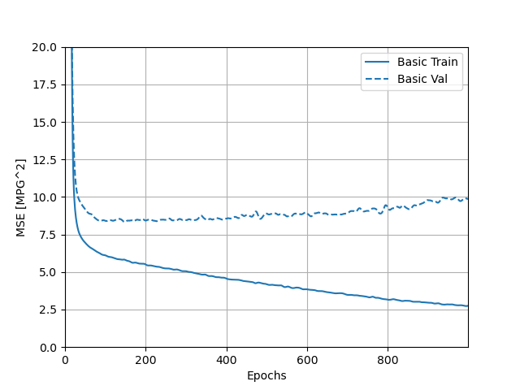

**A. Convolutional horses and humans**

  **1. Describe the ImageDataGenerator() command and its associated argument.  What objects and arguments do you need to specify in order to flow from the directory to the generated object?  What is the significance of specifying the target_size = as it relates to your source images of varying sizes? What considerations might you reference when programming the class mode = argument?  How much difference exists when applying the ImageDataGenerator() and .flow_from_directory() commands to the training and test datasets?**
  
*    The ImageDataGenerator() command allows us to use image data generators.  Its associated argument is called rescale, and it normalizes the images by the factor specified.  In the case of convolutionals with images of horses and humans, rescaling by dividing each byte value by 250 allows each byte's value to fall between 0 and 1.  
     
     To generate the training data, you need to use .flow_from_directory() with the training data generator created using ImageDataGenerator().  Likewise, to generate the testing data, you need to repeat this with the testing data generator created using ImageDataGenerator().  You then need to pass an argument to the .flow_from_directory() command that specifies which directory the data comes from.  For the training set, this would be your training directory; for the testing set, this would be your testing directory.  
     
     Whether generating the training data or testing data, you then need to specify the size of the images you would like to provide to the neural network.  This argument is called "target_size," and the images will all be fed through the neural network as that size, no matter what their original size happened to be.  Consequently, it is important to set an appropriate size for your image.  If you set a size that is too small for your images, you could cut off important features.  On the other hand, if you set a size that is too large for your images, you could be wasting valuable space in memory.  
     
     After that, you need to provide the batch size argument, which specifies how many training images to be loaded in a group together.  Lastly, you need to set the class mode argument.  When setting a value for this argument, it is important to consider the dimensionality of the array of class labels.  If the array is two-dimensional, it would be best to use the categorical class mode.  Otherwise, if the array is one-dimensional, it is also important to consider the number of class labels.  If there are just two options (either 0 or 1), then it would be best to use the binary class mode.  If there are more than two, it is best to use the sparse class mode.  

     All of the arguments listed above need to be specified when applying the ImageDataGenerator() and .flow_from_directory() commands, both to the training dataset *and* the testing dataset.  The argument to ImageDataGenerator() is "rescale" and the arguments to .flow_from_directory() include the directory name, "target_size," "batch_size," and "class_mode."  The only difference between the application to the training dataset versus the test dataset is that you would be using two distinct directories that refer to the the training images and testing images, respectively.  Likewise, the data generators would have different names to indicate that one is to be used for training data, while the other is to be used for testing data.

  **2. Describe the model architecture of the horses and humans CNN as you have specified it.  Did you modify the number of filters in your Conv2D layers?  How do image sizes decrease as they are passed from each of your Conv2D layers to your MaxPooling2D layer and on to the next iteration?  Finally, which activation function have you selected for your output layer?  What is the significance of this argument’s function within the context of your CNN’s prediction of whether an image is a horse or a human?  What functions have you used in the arguments of your model compiler?**

***I have attached a table depicting the model architecture of my horses and humans CNN below:***

*    The model architecture of my horses and humans CNN includes three Conv2D layers, three MaxPooling2D layers, a flattening layer, and two final Dense layers.  The first convolving (i.e., Conv2D) layer contains 16 filters, the second contains 32 filters, and the last includes 64 filters.  All three convolving layers also use 3x3-sized filters, and the first layer indicates that the input to the model will be a 300x300-sized image with a 3-byte color depth.  The number of filters increases in each of these layers as the size of the image decreases.  
      
     After passing through a convolving layer, the image loses its side borders.  Thus, the size of the image decreases by 2, in both dimensions, each time it passes through a Conv2D layer.  This can be seen in the table above, where the picture decreased in size from 300x300 to 298x298 after passing through the initial Conv2D layer of the neural network.  The pooling (i.e., MaxPooling2D) layers "pool" together 2x2 chunks of pixels from the images that pass through them.  In effect, the image is  decreased by a quarter of its previous size each time it passes through a pooling layer.  This is because each of the image's dimensions shrink by half.  
      
     After passing through the flattening layer, the data will be stored in a one-dimensional array.  The Dense layers then determine the probability that the image portrays a human or a horse.  

     The table above summarizes the model architecture for my initial CNN to predict whether an images is a horse or a human.  After completing yesterday's assignment and learning that 32 filters in the initial convolving layer yielded a slightly more accurate model than the neural network with 16 filters in the initial convolving layer, I decided to create another CNN with 32 filters in the initial layer, 64 in the second convolving layer, and 128 in the third/final convolving layer.  However, in this application to horses and humans, the CNN with more filters actually had a lower final accuracy and higher loss value than the original CNN.  The final accuracy for the original CNN was approximatey 0.86, while the final accuracy for the CNN with more filters was approximately 0.84; the final loss for the original CNN was approximately 0.00081, while the final loss for the CNN with more filters was approximately 0.00020.

     The model utilizes the relu activation function in all of the convolving layers, as well as the first Dense layer.  Relu ensures there are no negative neural outputs by setting all negative output values equal to 0.  It is important to do this because negative outputs in one layer of the neural network could impede the accuracy of the model's results by canceling out positive outputs in subsequent layers.  
      
     The output layer, which is also the final Dense layer, uses the sigmoid activaton function.  The sigmoid function yields a single output value between 0 and 1, where a '0' means that an object definitely belongs to one class and a '1' means that an object definitely belongs to the other class.  Values that fall between 0 and 1 indicate that the model is less sure of its classification decision.  In this case, a '0' indicates the model is completely confident in its decision that the image depicts a horse.  On the other hand, a '1' indicates the model is completely confident that the image portrays a human.  Since this is a binary classification problem and the sigmoid activation function is being used, the last layer is allowed to contain only one neuron.  
      
     Within the model's compiler, there are three arguments: loss, optimizer, and metrics.  Binary Cross-Entropy is provided as the function for the "loss" argument, as the model is using binary classification in order to classify an object as one of two things: a human or a horse.  The RMSprop function is provided for the "optimizer" argument, with an initial learning rate of 0.001.  RMSprop behaves similarly to the Adam optimizer, which we use often in this class, in that it adapts its learning rate based upon the status of various values in the model after each epoch, such as the loss value.  Lastly, the metrics argument uses the accuracy function, which records the accuracy of the model during training.

**I provided both my CNN that has twice as many filters in each layer and my original CNN with various images of famous people and horses to further test the models' accuracies on images they haven't seen before.  Some of the pictures show people riding horses for an added challenge.  I have attached the images and the models' predictions below.  Interestingly, both models were consistent, in that they shared the same prediction for each image.  They both seemed quite accurate, and a lot of the erroneous predictions seemed relatively reasonable.  For example, the images containing both humans and people would have made it difficult for the model to decide which subject was most prominent.  In addition, Taylor Swift has wispy/long-ish hair that may have made the model believe she was a horse.  In another instance, the front-facing view of Justify was predicted to depict a human.  This is likely because the image does not show much more of the horse than its face, so the model couldn't base its predictions off of the number of legs in the image or the presence of a long mane.  The erroneous prediction that Jimmy Fallon was a horse didn't seem as reasonable as the other errors, but this false prediction may have been caused by the busy nature of the background.**

*    Harry Styles

Original: Human

2x filters: Human

*    Jimmy Fallon

Original: Horse

2x filters: Horse

*    Taylor Swift

Original: Horse

2x filters: Horse

*    Taylor Swift On Horse

Original: Horse

2x filters: Horse

*    Secretariat

Original: Horse

2x filters: Horse

*    Secretariat's Son

Original: Horse

2x filters: Horse

*    Secretariat With Rider

Original: Horse

2x filters: Horse

*    Justify - 2018 Triple Crown Winner

Original: Horse

2x filters: Horse

*    Justify From Front Angle

Original: Human

2x filters: Human

*    Justify With Rider

Original: Horse

2x filters: Horse

---
---

**B. Regression**

  **1. Using the auto-mpg dataset (auto-mpg.data), upload the image where you used the seaborn library to pairwise plot the four variables specified in your model.  Describe how you could use this plot to investigate the co-relationship amongst each of your variables.  Are you able to identify interactions amongst variables with this plot?  What does the diagonal axis represent?  Explain what this function is describing with regarding to each of the variables.**
  
  
  
  *   The set of graphs above plot the datapoints for each of the four variables in the model (i.e., MPG, cylinders, displacement, and weight) against one another.  This allows us to visualize any relationships between each variable.  For example, there appears to be a positive, linear relationship between displacement and weight.  In other words, as the weight of the automobile increases, the displacement increases.  Likewise, as the automobile's displacement increases, its weight increases.  There also appears to be positive relationships between the number of cylinders and the automobile's weight, as well as the number of cylinders and the automobile's displacement.  In other words, as the number of cylinders increases, the automobile's weight increases; and vice versa.  Similarly, as the number of cylinders increases, the automobile's displacement increases; and vice versa.  However, the data forms clusters, so it is unclear what type of relationship exists between these variables beyond this.  Additionally, there appears to be a negative logarithmic relationship between the autombile's MPG and weight, as well as the automobile's MPG and displacement.  As the autombile's MPG increases, the weight gradually decreases; and vice versa.  Likewise, as the automobile's MPG increases, the displacement gradually decreases; and vice versa.  The relationship between the number of cylinders and the automobile's MPG is unclear, but the data does appear to be clustered.  The plots along the diagonal axis represent the variables plotted against themselves, which depict the distribution of the given variable's data (since a variable has a perfect correlation with itself).  More specifically, the code that produces this pairwise plot uses the kde function for the 'diag_kind' argument, which provides a kernel density estimate that predicts the probability distribution of the data and creates univariate plots of the distribution for each variable.  This functions by centering a normal curve at each of the variables' datapoints, summing the curves together, and then plotting a single normal curve with an area of 1 for each of the variables.

  **2. After running model.fit() on the auto-mpg.data data object, you returned the hist.tail() from the dataset where the training loss, MAE & MSE were recorded as well as those same variables for the validating dataset.  What interpretation can you offer when considering these last 5 observations from the model output?  Does the model continue to improve even during each of these last 5 steps?  Can you include a plot to illustrate your answer?**  
  
*     I have attached a screenshot of the output returned by the hist.tail() that recorded the loss, MAE, and MSE for the training and testing/validation sets below.  In addition, I have attached plots of these three values over time, for both the training and testing sets.  Looking at the numerical output, while there was some fluctuation in the loss, MAE, and MSE for the training set across these last five observations, they still tended to decline over time.  The plots of the loss, MAE, and MSE for the training set also confirm this, as the training curves all continued to decline over time.  For the testing set, the numerical output for the loss, MAE, and MSE also fluctuated across the last five observations, but the loss and MSE actually tended to increase over time.  The variation makes it less clear whether the MAE increased, but it appears to be rising too.  This can be confirmed by referring to the plots.  While the loss, MAE, and MSE of the testing set all initially declined, all three of these values actually began to increase after the reaching the 100th epoch.  Interestingly, the incrase in MAE was a little more subtle than the increase in MSE and loss.  

*     The decline in testing accuracy of the model after the 100th epoch, as evidenced by the increase in loss, MAE, and MSE, demonstrates why it was important to include a callback in the model.  This callback told the neural network to stop training once the testing accuracy stopped improving (which would have occurred when the loss, MAE, and MSE of the testing set started to increase) to prevent overfitting.
  
      

*     Loss:

      
      
*     Mean Absolute Error (MAE):

      
      
*     Mean Standard Error (MSE):

      

---
---

**C. Overfit and Underfit**

  **1. What was the significance of comparing the 4 different sized models (tiny, small, medium, large)?  Can you include a plot to illustrate your answer?**
  
  *   The different sized models were compared to show the extent of over- and under-fitting when the number of parameters determined by the model (i.e., the model's capacity) are altered.  The greater the number of parameters that can be learned, the more overfit the model tends to be.  This is because the model is better at mapping to the training set than it is  at generalizing predictions to data it has never seen before.  On the other hand, the fewer the parameters to be learned, the more underfit the model tends to be.  This is because the model can't really map well to the training data, which also causes the model to be similarly less accurate at generalizing to data it hasn't seen before.  The tiny model was the most underfit, with both a low training and testing/validation accuracy.  The small model was an improvement, but it was still underfit, with both a low training and testing accuracy.  The medium model improved greatly on its training accuracy, but the testing accuracy remained quite similar to that of the tiny model.  Thus, the medium model was slightly overfit.  The large model achieved perfect accuracy on the training data and the testing accuracy slightly improved from the medium model, but also stayed similar to that of the tiny model.  Consequently, the large model was the most overfit.  As such, the medium model would likely be the best option for this dataset, as it increases the training accuracy without being quite as overfit as the large model.  I have attached a plot portraying the models' training and testing accuracies below.  The overfitting of the large and medium model can be seen in the divergence of their respective training and validation curves.  It was interesting to see the training and validation losses for the large model begin diverging in the opposite directions sooner than those of the medium model, which validates that running fewer epochs during training can help mitigate overfitting.  According to the plot, the small and tiny models both appear to be properly fit, as the training and validation curves tend to stay close together across the epochs.  However, the training and validation curves appear to be beginning to diverge towards the far right edge of the plot (at around 10^3 epochs).  Consequently, it would be important to not go beyond this point when selecting the optimal number of epochs for training the small and tiny models.
  
  
   
