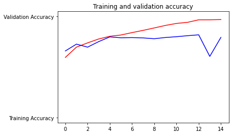
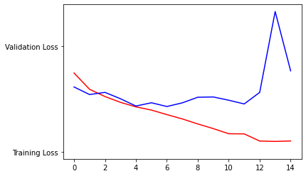
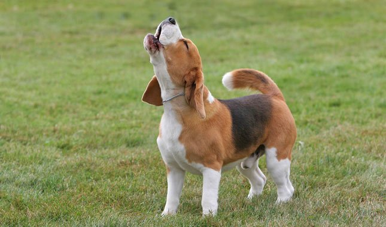
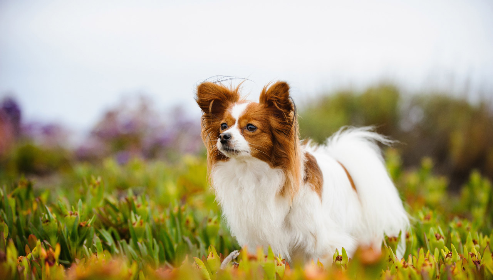
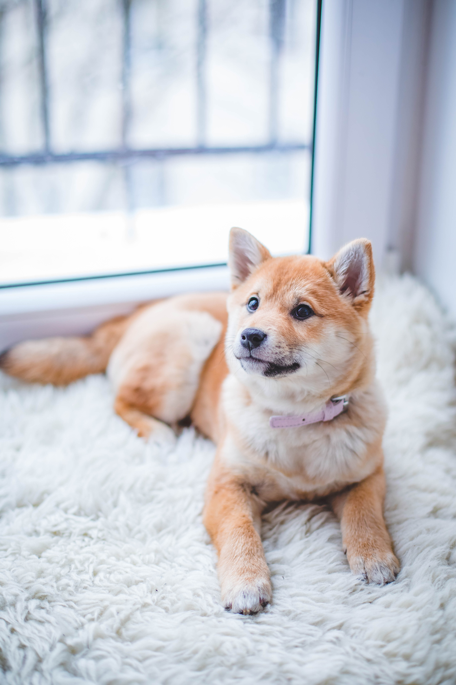
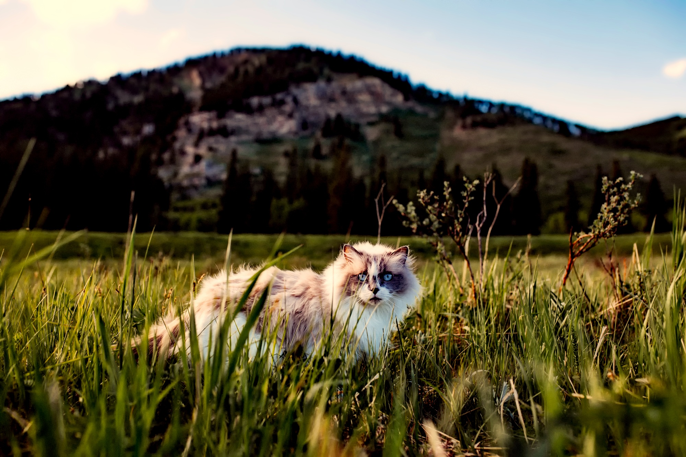
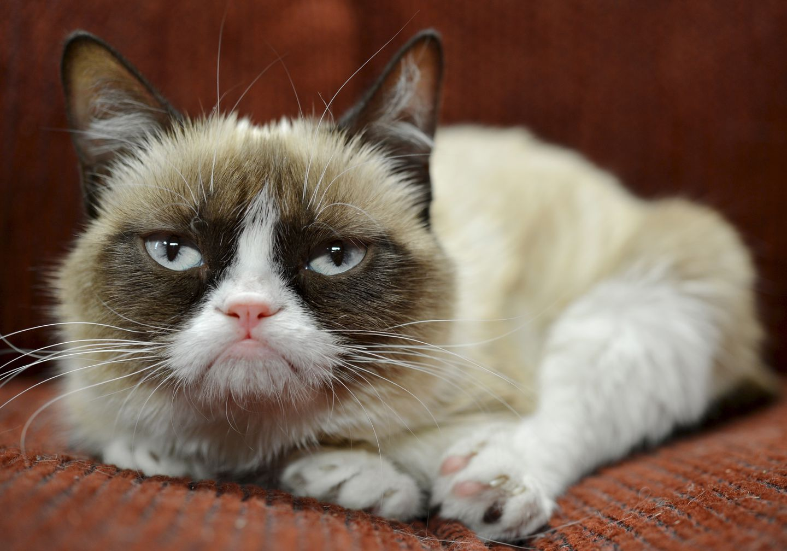
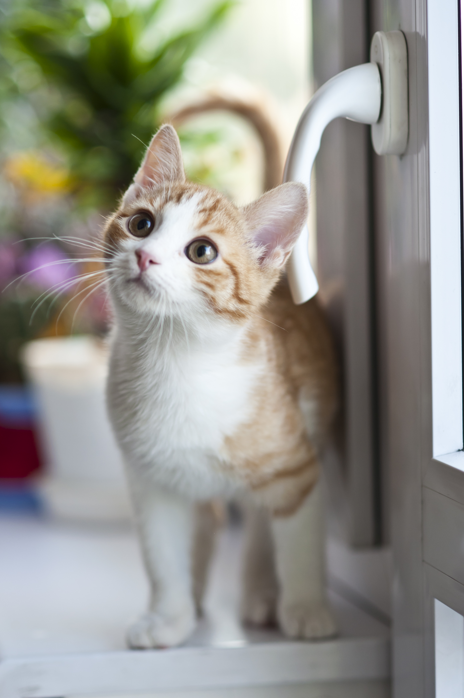

**A. Write a Problem Statement.  Introduce your topic, quantify its significance, and describe the problem as a process.  Identify and quantify significant obstacles to solving your problem.  Demonstrate why your topic is important, and why the obstacles associated with your topic are significant both globally as well as within the context of your selected application. Describe and analyze the complex nature of the process you are investigating, including the system, the environment, agents and networks. Describe and analyze scope, scale and hierarchy of processes and sub-processes. Describe and analyze factors that contribute to quantified obstacles.  Describe and analyze process oriented causes-effect relationships.**
*   For my final project, I would like to create a convolutional neural network (CNN) to produce a model that can read people's emotions.  First, the model would use facial recognition techniques to read the expression of a person's face in the camera.  Then, it would produce an audio and/or text output informing the user of the person's apparent emotional status.  

    This model would be useful for those who are visually-impaired, because the model could help them gauge how the person in front of them is feeling as they interact with each other.  The model could also be helpful for those on the autism spectrum who may have difficulty interpreting facial expressions and need some assistance.  After performing further research on potential applications of this model, I also discovered that this model could be useful for online education platforms.  By detecting frustration or some level of upsetness, the learning platform could alert the teacher/tutor that the student is having difficulty with the assignment and recommend that they provide the student with assistance.  Consequently, I believe this model would be significantly useful for a wide demographic of people, which could improve quality of life by promoting positive social interaction and enhancing the effectivity of education across the globe.
    
    I would first need to setup facial recognition to allow the model to detect key facial features.  Then, I would need to train the model on a set of facial expressions that portray the "seven basic emotions," which include happiness, sadness, surprise, anger, fear, disgust, and neutrality.  After searching through Harvard's Dataverse search engine, I found a selection of such images that should work well for this model at [https://doi.org/10.7910/DVN/358QMQ](https://doi.org/10.7910/DVN/358QMQ).  During this process, I could vary the number of layers and potentially add dropout layers to improve the model's accuracy and prevent overfitting.  I will then add in the ability to classify the seven emotions based on video input from the webcam.
    
    Some obstacles to the accuracy of the model include the fact that, sometimes, people's facial expressions are incongruous with how they truly feel.  People often internalize their feelings and don't let them surface.  For example, people may put on appearances to look cheerful and excited, but really feel unhappy and stressed.  In addition, some people have a neutral expression that makes it difficult to determine whether they are happy or sad.  However, this concern may not prove to be much of a hindrance because the person's tone of voice can help resolve any uncertainty and validate any assumptions made based on appearances.  Another potential obstacle would be trying to detect facial expressions in suboptimal conditions, such as where lighting is insufficient.  In today's pandemic environment, these suboptimal conditions could also include people wearing face masks, which would prevent the model from using mouths in its decision-making process.

**B. Describe your implementation of the cats & dogs exercise.  How did you setup the data?**

*   For the cats and dogs exercise, I first installed the large .zip file of data and extracted the images.  Half of these images (12,501) depicted cats, while the other half depicted dogs.  I then created training and testing directories to store the images once they were split into training and testing/validation sets.  Within these directories, I created cat and dog subdirectories to store images of each animal from the training and testing sets, respectively.  Next, I split the full dataset into the training and testing sets.  The training set contained 90% of the entire dataset, leaving the testing set with 10% of the images for validation of the model's accuracy at classifying images it hasn't seen before.  

    After this, I created a convolutional neural network (CNN) to produce the model.  Within this CNN, there are three pairs of convolving and pooling layers.  The first Conv2D layer contains 16 3x3 filters, the second contains 32, and the final Conv2D layer contains 64 3x3 filters.  The input image size to the first layer was set to 150x150 with 3 bytes per pixel.  All three of these layers use the ReLU activation function to prevent negative neural outputs from skewing results by cancelling out future positive outputs.  ReLU does this by setting negative outputs to zero.  The MaxPooling2D layers reduce the size of the image by 1/4 each time the image data passes through a pooling layer, while still keeping the important features highlighted by the convolving layers intact.  The CNN then contains a flattening layer to compress the convolving and pooling layers' output to a one-dimensional array.  There are two more Dense layers in the CNN, and the final Dense layer contains just one neuron with a sigmoid activation function.  This final layer will make a prediction, between 0 and 1, of which class the image falls into.  In other words, it decides if the image depicts a cat or a dog.  The model compiler uses an RMSProp optimizer, Binary Crossentropy loss function, and an accuracy metric.
       
    Next, I created a training and testing data generator, which rescaled the images in each directory by dividing by 255 and pulled images in batches of 250.  The class modes for these generators were set to binary, as the images depict one of two options (cat or dog), and the target sizes were set to 150x150 to keep the input images a consistent size.  The model was then fit to the data, and the epoch steps were set by dividing the number of images by the batch size for better performance.
       
    To evaluate the model's performance, I then plotted the training/validation accuracy and loss and compared them.  I also uploaded several images of dogs and cats to further test the model's predictive accuracy on images it hadn't seen before.
   
   **1. Which optimizer have you selected, and how might it compare to other possible choices?**
    
*    I selected the RMSProp optimizer, with the initial learning rate set to 0.001.  RMSProp is a better choice than the RProp optimizer when using large datasets with very small batches because RMSProp determines the next learning rate by dividing by the moving average of the batch's gradient, which allows the gradient to stay around the same value.  With small batches, RProp has difficulty maintaining its magnitude because it relies on the gradient's sign (i.e., positive or negative).  RMSProp is also a better choice than Adagrade because RMSProp keeps the gradient from stopping at a "saddle point" by keeping a moving average of squared gradients, rather than accruing the squared gradients over time.  RMSProp also travels through these "saddle points" much more quickly than Adagrad and alternative optimizers like SGD, Momentum, NAG, or Adadelta.
    
   **2. Describe your selected loss function and it’s implementation.  How is it effectively penalizing bad predictions?**
    
*    I selected the Binary Crossentropy loss function because this is a binary classification problem in which the model must decide if a picture portrays one of two types of animal: a cat or a dog.  This loss function works by predicting the probability that the image depicts a cat (labeled as a '0') or a dog (labeled as a '1').  The dog image predictions' probabilities are represented by the area under the sigmoid curve that ranges from a probability of 0 to 1, while the cat image predictions' probabilities are represented by the area above the sigmoid curve.  The Binary Crossentropy function penalizes bad predictions by yielding a higher loss value than more accurate predictions.  It does this by computing the negative log of the probabilities for every image, which approach positive infinity as the predictions' probabilities approach 0.  Then, these negative log values are averaged together to compute the final Binary Crossentropy loss.            
    
   **3. What is the purpose of the metric= argument in your model.compile() function?**
   
*    The metric= argument helps evaluate the model's performance outside of the training set.  The value of the selected metric is saved and output during the fitting process, and can also be output using .evaluate().  In the case of this model, which predicts whether an image depicts a dog or a cat, I selected the 'acc' metric.  'Acc' stands for accuracy and records the test/validation accuracy of the model.
   
   **4. Plot the accuracy and loss results for both the training and test datasets.  Include these in your response.  Assess the model and describe how good you think it performed.**

*   In these plots, which I have attached below, the red curves represent the training dataset and the blue curves represent the testing dataset.

   
 
*   Interestingly, the testing accuracy started out higher than the training set.  This indicates that the model was underfit for this time period, which follows from the model being early in its training process during this time.  The training and testing accuracies stay close together for the next two or three epochs before the curves begin to diverge.  This divergence, where the testing accuracy stabilizes (and even begins to decline) while the training accuracy continues to rise, indicates the model is overfit.
    
   
    
*   The plot of training and testing loss helps to validate the information provided by the plot of training and testing accuracy above.  For example, the testing loss started out lower than the training set up to the first epoch.  This helps to confirm the model was underfit because it was more accurate on the testing set (as indicated by the lower loss value) during the early phases of training.  Like the accuracy curves, the training and testing losses stay pretty close together for the next two or three epochs before beginning to diverge.  At approximately the fourth epoch, the testing loss actually begins to increase.  This helps validate the accuracy chart, which shows the testing accuracy stabilize and then decline after the fourth epoch.
    
   **5. Use the model to predict 3 dog images and 3 cat images.  Upload you images and the prediction.  How did your model perform in practice?  Do you have any ideas of how to improve the model’s performance?**
   
*    I have attached the images and their respective predictions below, and the model didn't seem very accurate with the images I uploaded.  In fact, it only got one correct - the beagle.  However, out of curiousity, I purposefully provided it with images that I thought would be difficult for it to predict.  For example, the papillon (the second dog) has long hair and pointy ears, which could understandably make the model believe it is looking at a cat.  Likewise, the third dog also had pointy ears with semi-long hair.  This third picture also posed another problem: the softening blur effect may have prevented the model from detecting some key, identifiying features.  To improve the model's performance on images of dogs, I would add more pictures to the training set that don't fit the more-traditional image of a dog.  For example, I would add more images of dogs with pointy ears, rather than floppy ears.  I would also add more images of smaller dogs that could be confused for a cat because of their size.  Since the blur effect appeared to cause problems for the model, it may be helpful to add low-quality images to the training set to improve the model's ability to detect key features from blurry pictures.

     With regards to the cat images, perhaps the first image proved to be difficult to accurately predict because the cat was obscured by the long grass.  For the second image, maybe the model wasn't very well-trained on images of cats lying down.  The third cat image, which depicted a kitten, posed a similar complication as the third dog image.  Both had a softening blur effect that may have prevented the model from detecting important, identifying features.  Potentially, the model was unable to identify this third image as a cat because the model wasn't very well-trained on images of kittens.  To improve the model's performance, I would include more images of cats in non-standing poses, like when lying down or being held.  I would also include more pictures of cats that have bushy tails, since this could cause them to be confused for a dog. 
     
     The model also appears to have difficulty when viewing the animal from the front, rather than from a side profile (like the beagle).  Consequently, I think it would be helpful to include more images of cats and dogs taken from a frontal view.

---
   
**Dogs:**
    
* **Beagle - Predicted to be a dog** 
 
   
   
    
* **Papillon - Predicted to be a cat**  
 
   
    
    
* **Fluffy Dog - Predicted to be a cat**   
   
    

---
   
   
**Cats:**
   
* **Fluffy Cat - Predicted to be a dog**  
   
   

* **Grumpy Cat - Predicted to be a dog**    
   
   
   
* **Kitten - Predicted to be a dog**  
   
   
