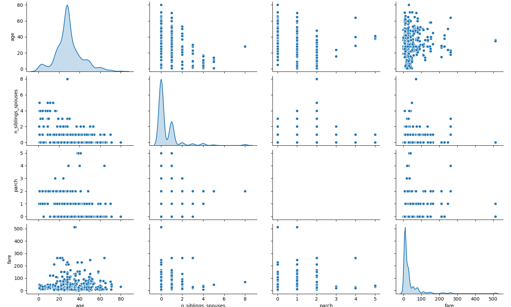
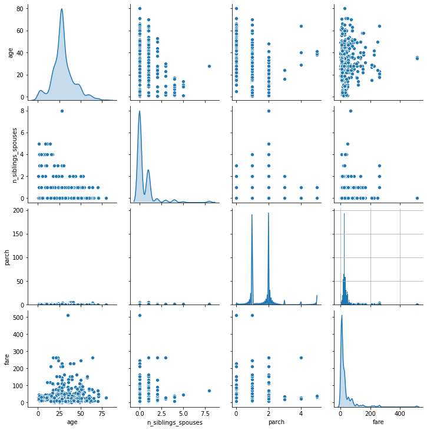
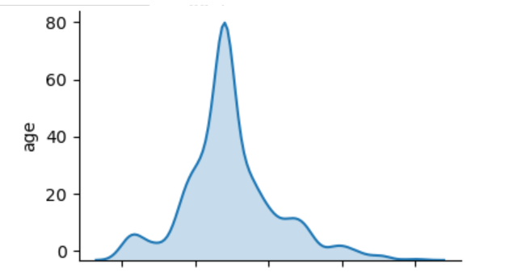
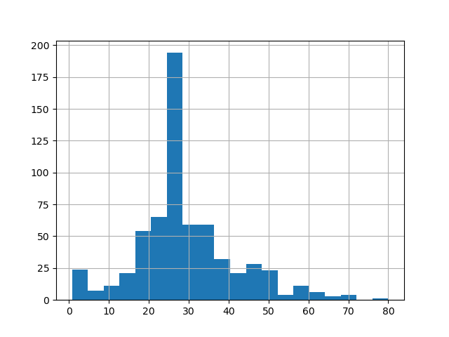
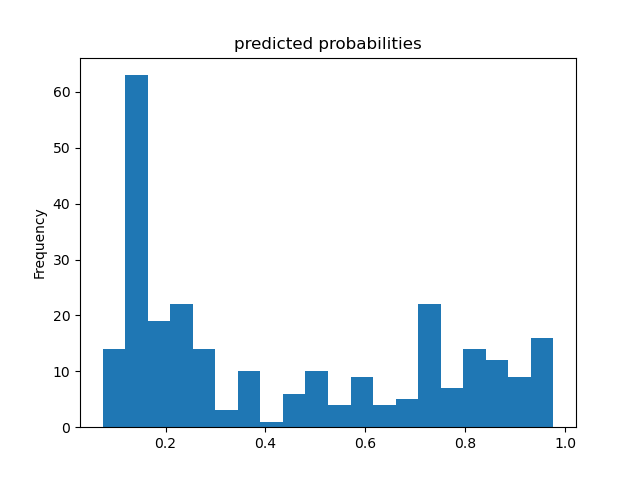
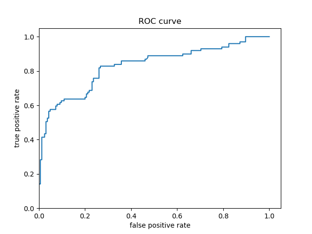
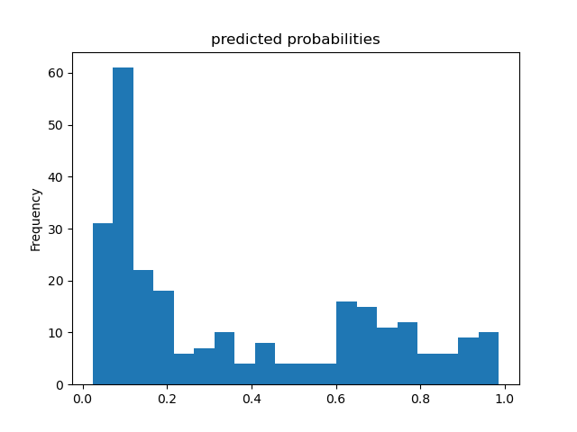
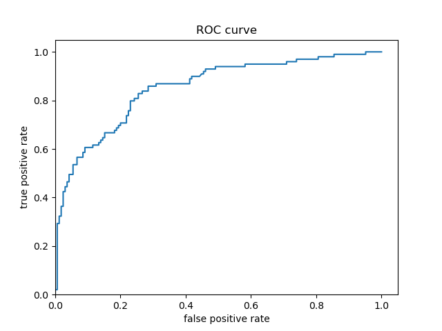
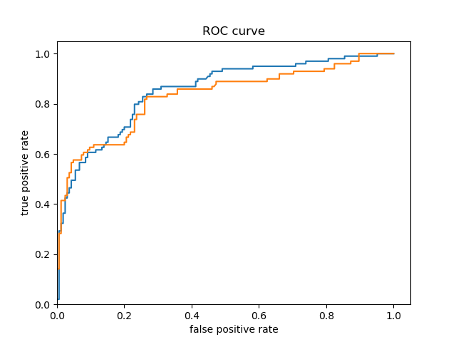

**A. Premade Estimators**

**1. How did you split the labels from the training set?  What was the name of the labels dataset?**

*  I split the labels from the training set by creating a variable named "train_y" to store the values returned by calling .pop() on the training set's labels column.  This column was named "Species."  In other words, I removed the species labels from the training set and stored them in another variable.

**2. List 5 different estimators from tf.estimator and include the base command as you would write it in a script (for example this script used the tf.estimator.DNNClassifier() function from the API).**

   1.  BaseLine Classifier - the script uses the tf.estimator.BaselineClassifier function from the API.  To instantiate this estimator for the Iris dataset, you would write classifier = tf.estimator.BaselineClassifier(n_classes=3).  You would then use input functions for training and evaluation, but not prediction.  For training, you call classifier.train on the input function used for training; for evaluation, you calculate the model's loss value by calling classifier.evaluate on the input function used for evaluating.  For prediction, you call classifier.predict on the testing set.
   
       *      baseline_classifier = tf.estimator.BaselineClassifier(n_classes=3)
      
              def input_fn_training:
                pass
              def input_fn_evaluation:
                pass
         
              baseline_classifier.train(input_fn=input_fn_training)
      
              loss_val = baseline_classifier.evaluate(input_fn=input_fn_evaluation)["loss"]
      
              prediction = baseline_classifier.predict(test_set)

   2.  BaseLine Estimator - the script uses the tf.estimator.BaselineEstimator function from the API.  To use this estimator for the Iris dataset, you would write estimator = tf.estimator.BaselineEstimator(head=tf.estimator.MultiLabelHead(n_classes=3)).  You would then use input functions for training and evaluation, but not prediction.  For training, you call estimator.train on the input function used for training; for evaluation, you calculate the model's loss value by calling estimator.evaluate on the input function used for evaluating.  For prediction, you call estimator.predict on the testing set.
   
       *      baseline_estimator = tf.estimator.BaselineEstimator(head=tf.estimator.MultiLabelHead(n_classes=3))
      
              def input_fn_training:
                pass
              def input_fn_evaluation:
                pass
         
              baseline_estimator.train(input_fn=input_fn_training)
      
              loss_val = baseline_estimator.evaluate(input_fn=input_fn_evaluation)["loss"]
      
              prediction = baseline_estimator.predict(test_set)

   3.  Linear Classifier - the script uses the tf.estimator.LinearClassifier function from the API.  To instantiate this estimator for the Iris dataset, you would write classifier = tf.estimator.LinearClassifier(feature_columns=my_feature_columns, n_classes=3).  You would then use input functions for training, evaluation, and prediction.  For training, you call classifier.train on the input function used for training; for evaluation, you calculate the model's loss value by calling classifier.evaluate on the input function used for evaluating; for prediction, you call classifier.predict on the input function used for predicting.

       *      linear_classifier = tf.estimator.LinearClassifier(feature_columns=my_feature_columns, n_classes=3)
      
              def input_fn_training:
                pass
              def input_fn_evaluation:
                pass
              def input_fn_prediction:
                pass
         
              linear_classifier.train(input_fn=input_fn_training)
      
              loss_val = linear_classifier.evaluate(input_fn=input_fn_evaluation)["loss"]
      
              prediction = linear_classifier.predict(input_fn=input_fn_prediction)

   4. DNN Linear Combined Classifier - the script uses the tf.estimator.DNNLinearCombinedClassifier function from the API.  To instantiate this estimator for the Iris dataset, you must first create crossed feature columns for the Estimator's linear settings and embedding feature columns for the Estimator's DNN settings. Then, you would write classifier = tf.estimator.DNNLinearCombinedClassifier(linear_feature_columns=my_feature_columns, dnn_feature_columns=my_feature_columns, dnn_hidden_units=[30, 10], n_classes=3).  
   
        You would then use input functions for training, evaluation, and prediction.  For training, you call classifier.train on the input function used for training; for evaluation, you calculate the model's loss value by calling classifier.evaluate on the input function used for evaluating; for prediction, you call classifier.predict on the input function used for predicting.
   
       *      combo_classifier = tf.estimator.DNNLinearCombinedClassifier(
                                  # wide settings
                                  linear_feature_columns=my_crossed_feature_columns,
                                  # deep settings
                                  dnn_feature_columns=my_embedding_feature_columns,
                                  dnn_hidden_units=[30, 10]m
                                  n_classes=3)
      
              def input_fn_training:
                pass
              def input_fn_evaluation:
                pass
              def input_fn_prediction:
                pass
         
              combo_classifier.train(input_fn=input_fn_training)
      
              loss_val = combo_classifier.evaluate(input_fn=input_fn_evaluation)["loss"]
      
              prediction = combo_classifier.predict(input_fn=input_fn_prediction)   
   

   5. Boosted Trees Classifier - the script uses the tf.estimator.BoostedTreesClassifier function from the API.  To instantiate this estimator for the Iris dataset, you would write classifier = tf.estimator.BoostedTreesClassifier(feature_columns=my_feature_columns, n_classes=3).  You would then use input functions for training, evaluation, and prediction.  For training, you call classifier.train on the input function used for training; for evaluation, you calculate the model's loss value by calling classifier.evaluate on the input function used for evaluating; for prediction, you call classifier.predict on the input function used for predicting.

      *       tree_classifier = tf.estimator.BoostedTreesClassifier(feature_columns=my_feature_columns, n_classes=3)
      
              def input_fn_training:
                pass
              def input_fn_evaluation:
                pass
              def input_fn_prediction:
                pass
         
              tree_classifier.train(input_fn=input_fn_training)
      
              loss_val = tree_classifier.evaluate(input_fn=input_fn_evaluation)["loss"]
      
              prediction = tree_classifier.predict(input_fn=input_fn_prediction)- 

**3. What are the purposes of input functions and defining feature columns?**

*   Input functions provide training, testing, and prediction data.  One input function (i.e., input_validation_set()) first does this by returning a dataset object that outputs a feature dictionary, which contains features mapped to their respective values, as well as an array of label values.  Another function (i.e., input_fn()) then places this data into a dataset, shuffles the data in the dataset during model training, and returns batches of the shuffled data for training.  This same function then gets used with a lambda when training and evaluating the model to store arguments.  During evaluation, input_fn runs just one epoch.  After this, input_fn places batches of input into a datset without labels and is again used with lambda in the prediction stage of the model.  

*   It is important to define feature columns because these objects describe the features the model should use from the input functions' features dictionary.  The features data are placed in these columns and provide the identifying characteristics of the classes, which the model uses as the basis for its classification predictions.  In the case of this program, the feature columns include the sepal length, sepal width, petal length, and petal width; each of these can be used to identify the type of iris (i.e., Setosa, Versicolor, and Virginica).  These columns represent each feature as a 32 bit, floating point integer for the model.  Depending on the Estimator selected, the feature columns will also be passed to the feature column argument when instantiating the Estimator.

**4. Describe the command classifier.train() in detail.  What is the classifier and how did you define it?  Which nested function (and how have you defined it) are you applying to the training and testing sets?**

*   The command classifier.train() is a command from the tf.estimator API that is used to train the model using the data from the nested input function.  This input function is combined with a lambda to take arguments into a function that doesn't accept arguments.  I used the DNNClassifier and defined it by creating a variable called "classifier" and providing it with an instance of the DNNClassifier.  The instance was provided with the dataset's feature columns, a dense neural network (DNN) containing 30 hidden nodes in the first layer and 10 hidden nodes in the second layer, and the specification that there are three potential classes (one for each species of Iris).  The feature columns were provided as the "feature_columns" argument, the DNN with hidden nodes was provided as the "hidden_units" argument, and the three classes were provided as the "n_classes" argument.  I have included the code for this below.  A nested input function is also used to apply the testing set to the classifer.evaluate() command.  Similar to when training the model, the input function is combined with a lambda to take arguments into a function that doesn't accept arguments.

    *     classifier = tf.estimator.DNNClassifier(
              feature_columns=my_feature_columns,
              hidden_units=[30, 10],
              n_classes=3)

**5. Redefine your classifier using the DNNLinearCombinedClassifier() as well as the LinearClassifier().  Retrain your model and compare the results using the three different estimators you instantiated.  Rank the three estimators in terms of their performance.**

*   I have included the results for the DNNLinearCombinedClassifier() and LinearClassifier() below, as well as the original results with the DNNClassifier for reference.  Based on these results, the DNNLinearCombinedClassifier and LinearClassifier both achieved the highest accuracy of approximately 0.967.  While they both shared the same accuracy value, the average loss for the LinearClassifier was significantly lower than the average loss for the DNNLinearCombinedClassifier.  The average loss for the LinearClassifier was approximately 0.069 and the average loss for the DNNLinearCombinedClassifier was approximately 0.327, which indicates that the LinearClassifier was the-best performing classifier for this situation.  This is because the accuracy of a model is inversely proportional to its loss value.  The prediction probabilities also help to confirm that the LinearClassifier estimator had the best performance, as this produced the highest prediction probabilities out of all three estimators.

*   **1. LinearClassifier Results:**
      Testing Accuracy: 0.967
      Average Loss: 0.069
      
      This model correctly predicted a Setosa to be a Setosa with 99.2% probability, a Versicolor to be a Versicolor with 97.3% probability, and a Virginica to be a Virginica with 95.9% probability.

*   **2. DNNLinearCombinedClassifier Results:**
      Testing Accuracy: 0.967
      Average Loss: 0.327
      
      This model correctly predicted a Setosa to be a Setosa with 91.4% probability, a Versicolor to be a Versicolor with 57.5% probability, and a Virginica to be a Virginica with 69.5% probability.
      

*   **3. DNNClassifier Results:**
      Testing Accuracy: 0.733
      Average Loss: 0.587      
      
      This model correctly predicted a Setosa to be a Setosa with 58.0% probability, a Versicolor to be a Versicolor with 49.3% probability, and a Virginica to be a Virginica with 69.8% probability.
      

---
---

**B. Build a Linear Model**

**1. Using the dftrain dataset, upload an image where you used the seaborn library to produce a sns.pairplot().  Also include a histogram of age using the training set and compare it to the seaborn plot for that same feature (variable).  What interpretation can you provide of the data based on this plot?**

*   When plotting the pair plot of the dftrain dataset in the PyCharm IDE, the scale of the y-axis prevented the plot of the "parch" variable's probability density distribution from being seen.  To resolve this issue, I replotted the pair plot in Google Colaboratory.  This allowed the plot of the "parch" probability density distribution to be visible, but the necessary y-axis scaling to do so caused the datapoints on the remainder of the plots in this row to be difficult to read.  Consequently, I have attached links to both plots below so that all plots can be more easily seen.  By looking at the plots along the diagonal, we can see the probability density distribution of each variable.  The age, number of siblings and spouses, and fare distributions all appear to be right-skewed.  The shape of the distribution for the "parch" variable is slightly less clear, as it is bimodal, but it also appears to be right-skewed.  

     Clustering is prevalent in the plots of the remaining combinations of variables, except for the plots that graph age against fare.  Consequently, there doesn't seem to be any clear relationship between these two variables.  However, it may be important to note that the fare appears to mostly stay below $300.  It does appear as though there may be some sort of inverse relationship between age and the number of siblings and spouses, as older passengers tend to have a lower number of siblings and spouses.  But aside from the aforementioned clustering in their respective scatterplots, the relationships between the rest of the variables remain unclear.

    **PyCharm version:**
    
    
    
    
    
    **Google Colaboratory version:**
    
    
    
    
*   Below, I have also attached links to the seaborn plot of the age probability density distribution and histogram from the training set.  Both of these plots show us that the age distribution is right-skewed because there is a long tail towards the right side of plot.  As such, there are more datapoints to the left of the mean age than there are to the right.  In the context of ages, this means that there are few older passengers, but many young passengers.  The distribution is also univariate, so the mode age of Titanic passengers occurs at the peak of the seaborn distribution/the tallest column of the histogram, at about 25-27 years old.  Because of the right skew, the median age will be slightly higher than the mode age, at approximately 28 years old.  

     Although the probability density distribution and histogram convey the same key information about the age distribution of Titanic passengers, they do differ from each other in that the probability density distribution depicts continous data while the histogram depicts discrete data.

    **Seaborn Distribution (Age):**
    
    
    
    
    
    **Histogram (Age):**
    
    
     
     

**2. What is the difference between a categorical column and a dense feature?**

*   Categorical columns store features with non-numerical values.  You can inspect the data stored within these categorical feature columns using a DenseFeatures Keras layer.  However, DenseFeatures layers require a dense tensor parameter, so you would first need to convert the feature column to an indicator column.  Dense features identify the absence of a feature and allow the user to locate the specific space where that feature is missing by populating the dataset with zeroes.  The main difference between a categorical column and a dense feature is that the dense feature represents the non-numerical value of the categorical column as a numerical value through one-hot-encoding.

**3. Describe the feature columns that have been input to your LinearClassifier().  How would you assess the result from your initial output?  What is the purpose of adding a cross featured column?  Did your attempt to capture the interaction between age and gender and incorporate it into your model improve performance?  Include and interpret your predicted probabilities and ROC curve plots.**

*   I provided the feature columns of sex, n_siblings_spouses, parch, class, deck, embark_town, and alone.  Sex classifies the passengers as either male or female, n_siblings_spouses specifies the number of siblings or spouses onboard, parch specifies the number of parents and children onboard, class specifies whether the passengers are 1st/2nd/3rd class, deck specifies which deck the passengers' rooms were located on, embark_town specifies what towns the passengers embarked from, and alone classifies the passengers as traveling alone or with others.  After creating the initial LinearClassifier() model, I added a cross featured column of age and sex.  It was important to do this because the feature contribution of age to the model's predictions may have been influenced by the passengers' sex.  In other words, there may be a different relationship between age and males than there is between age and females.  For example, older women may have been more likely to survive than younger women, but it may have been the opposite for males, where younger men were more likely to survive than older men.  Consequently, it is best to determine the feature contribution of sex and age combined, rather than generalizing age across both sexes.

*   Based solely on the accuracy output for the initial model (prior to adding the cross featured column) versus the accuracy output for the model after adding the cross featured column, adding the column slightly improved the model's performance.  The initial accuracy was approximately 0.74, while the final accuracy was approximately 0.77.  To confirm this, I would also assess the result from my output by analyzing the ROC curve.  The ROC curve depicts the model's true positive rate vs. false positive rate of predictions. The accuracy of the model can be determined by the area under this curve.  Therefore, the more the ROC curve bows to the upper left corner of the graph, the more accurate the model is likely to be (since the more the curve bows, the greater is the area under the curve).  For example, if the ROC curve follows closely to the y-axis, then the model is very accurate.  Thus, the model yields many true positives.  On the other hand, if the ROC curve is drawn at a 45-degree angle across the graph, it is quite inaccurate because the model can't really differentiate between classes.  Thus, the model yields many false positives.  This concept is illustrated in the image below of various ROC curves.  Analyzing the histograms of each model's predicted probabilities may also help, because we can see how confident the models are in their decisions.

    

*  **Initial Model's Histogram of Predicted Probabilities and ROC Curve (prior to adding cross featured column)**
    
    
 
*  **Second Model's Histogram of Predicted Probabilities and ROC Curve (after adding cross featured column)**
    
    

*  **Both Model's ROC Curves**
    
    
*    In the case of the Titanic dataset model prior to adding a cross featured column, the ROC curve follows pretty closely to the y-axis for some time and bows quite significantly to the upper left corner.  Consequently, we can reasonably conclude that this model is quite accurate because of the large area beneath the curve.  After adding a cross featured column, it was difficult to distinguish between the new ROC curve and the initial model's ROC curve, so I plotted them together.  This can be seen in the third ROC curve plot above (with the blue and orange curve) - the orange curve represents the inital model's ROC and the blue curve represents the second model's ROC.  The initial model's orange ROC curve travels mostly underneath of the second model's blue ROC curve.  This means that the area under the second model's curve is greater than the intial model's curve, indicating that the second model (with the added cross featured column) is more accurate than the initial model.

*    In the Titanic dataset, a '1' means the passenger survived and '0' means they did not.  These predicted probability histograms plot the distribution of predictions the model made of the likelihood the passengers survived.  Since there appears to be a mode around 0 on both of the above histograms, both of the models predicted that a lot of passengers did not survive the Titanic.  Even though the models' histograms of predicted probabilities are quite similarly shaped, the inital model's histogram seems to show slighlty more predictions in the middle of the distribution, which may indicate that the inital model (without the added cross featured column) is not as confident in its predictions as the second model.
