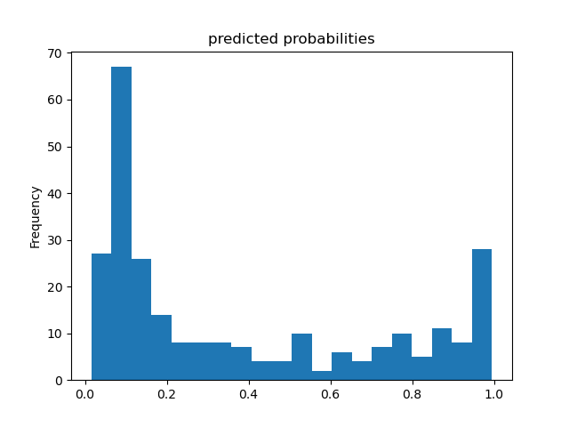
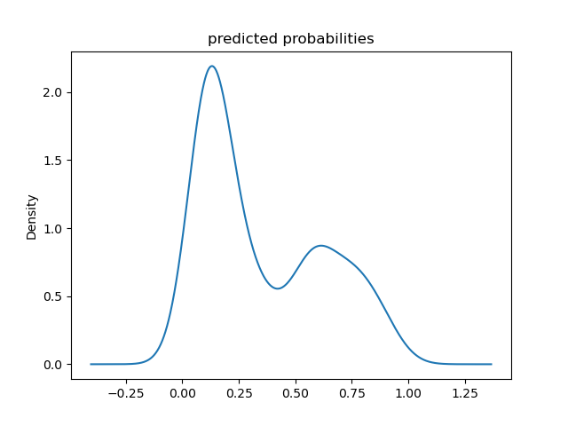
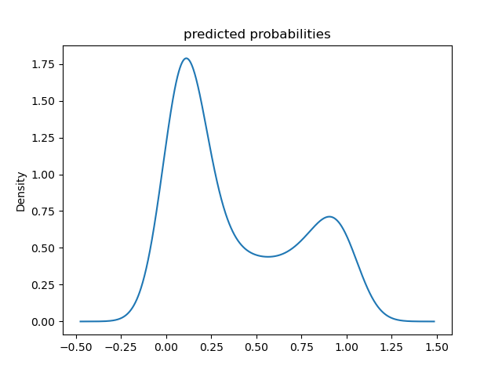
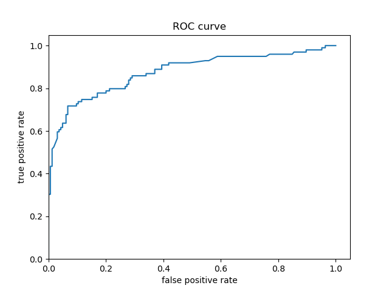
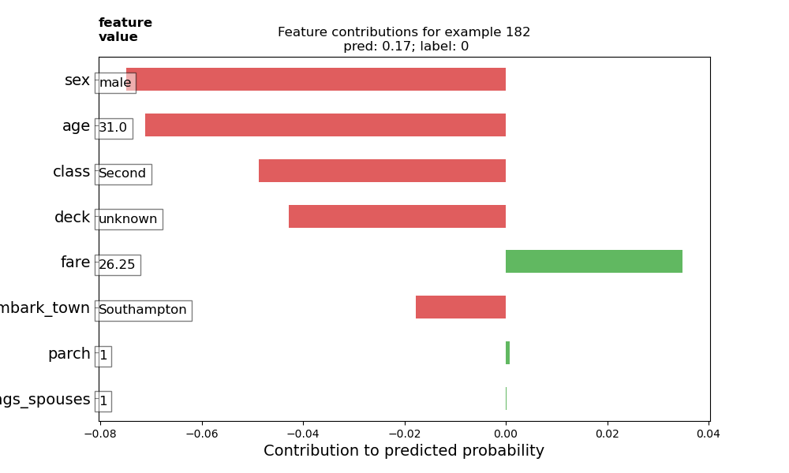
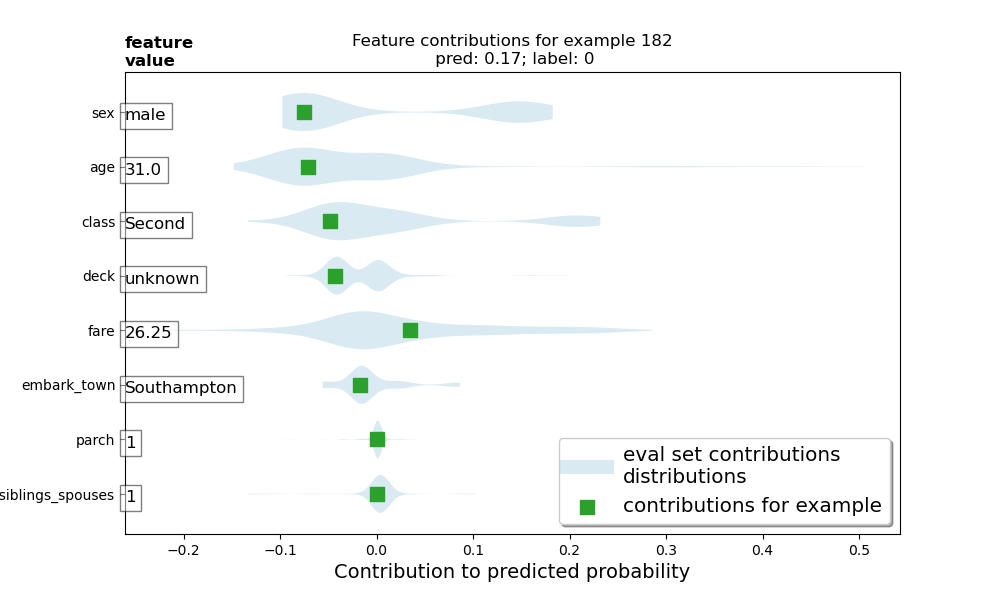
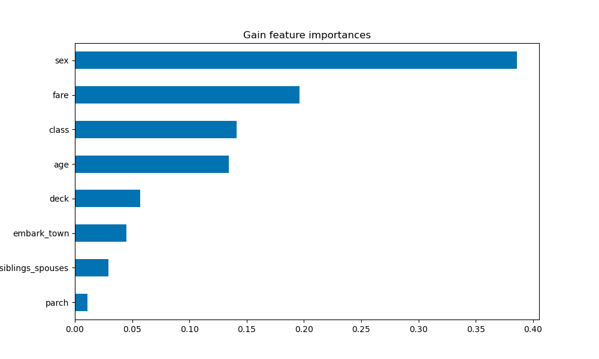
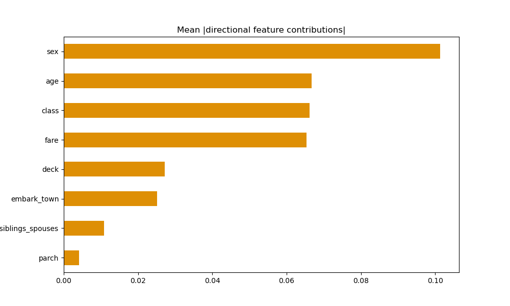
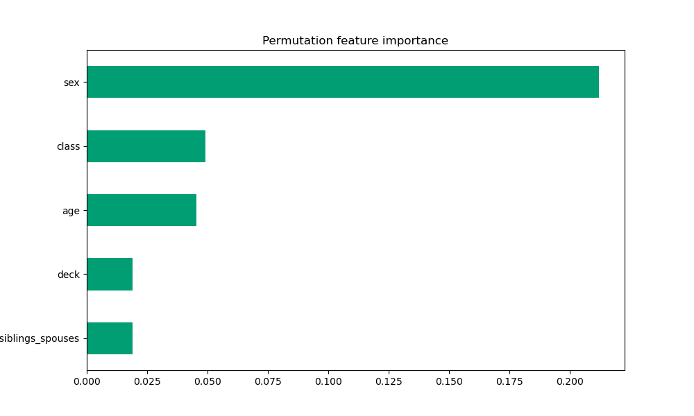

**A. Boosted Trees**

  **1. What is a one-hot-encoded column and why might it be needed when transforming a feature?  Are the source values continuous or discrete?**
  
*  A one-hot-encoded column is an indicator column that represents categorical features as a list of bytes.  It is often necessary to do so because some machine learning models require numerical values to make predictions.  Because the source feature columns were originally categorical, the source values are discrete datapoints.

  **2. What is a dense feature?  For example, if you execute example = dict(dftrain) and then tf.keras.layers.DenseFeatures(your_features)(your_object).numpy(), how has the content of your data frame been transformed?  Why might this be useful?**
  
*  A dense feature is a Keras layer that transforms the categorical feature column value into a numerical value via one-hot-encoding.  For example, running the lines of code in the question would cause all feature columns to be converted from a categorical column to a one-hot-encoded column.  Not only is this useful for the model to make predictions, as mentioned previously, but it also allows us to easily view which features are absent and where they are located by locating the zeroes in the transformed data.  This also allows us to view which features are most common and where they are located.

  **3. Provide a histogram of the probabilities for the logistic regression as well as your boosted tree model.  How do you interpret the two different models?  Are their predictions essentially the same or is there some area where they are noticeable different.  Plot the probability density function of the resulting probability predictions from the two models and use them to further illustrate your argument.  Include the ROC plot and interpret it with regard to the proportion of true to false positive rates, as well as the area under the ROC curve.  How does the measure of the AUC reflect upon the predictive power of your model?**
  
*  Overall, both models predicted very similarly to each other.  However, there were some slight differences.  For example, the boosted tree model predicted that more passengers survived and, consequently, fewer passengers were predicted to not survive the Titanic than in the logistic regression model.  I have attached histograms, probability density functions, and ROC curves (with further description for each) of the predicted probabilities of survival below.

*  **Predicted Probability Histogram - Logistic Regression:**

  

*  **Predicted Probability Histogram - Boosted Trees:**

  

*  The histograms indicate that both models are potentially bimodal, but this is more clear in the boosted tree model.  While the primary mode for both models is approximately 0.1, indicating that most passengers did not survive, the boosted tree model has a secondary mode at approximately 1.0, indicating that a rather significant portion of the passengers did survive.  There may also be a secondary mode for the logistic regression model at approximately 0.6, which indicates that this linear model is less confident in its predictions that these passengers survived.  Given the boosted tree model's secondary mode was approximately 1.0, we can deduce that the boosted tree model is much more confident in its predictions that these passengers survived.

*  **Predicted Probability Density Function - Logistic Regression:**

  

*  **Predicted Probability Density Function - Boosted Trees:**

  

*  The probability density functions confirm that both models are bimodal, as previously indicated by the histograms.  These continous shape of the probability density plots also make the range of probabilities over which the modes occur more clear.  For example, the second peak in the logistic regression model spans a wider set of probabilities than is apparent in the logistic regression model's histogram.  The primary mode for both models remains at approximately 0.1, the boosted tree model's secondary mode appears to be centered at approximately 0.9, and the secondary mode for the logistic regression model still peaks at approximately 0.6.

*  **Predicted Probability ROC - Logistic Regression:**

  

*  **Predicted Probability ROC - Boosted Trees:**

  

*  The ROC curves for both models are very similar, which indicates both models have similarly accurate predictions.  This is confirmed by the strong similarity between the shapes of the predicted probability distributions displayed in the histograms and probability density functions for both models.  However, the boosted tree model's ROC curve appears to follow the y-axis slightly longer than the logistic regression model's ROC curve.  The logistic regression model mostly appears to begin diverging around a true positive prediction (i.e., correct prediction) rate of 0.60, but this doesn't appear to begin until a true positive prediction rate of approximately 0.70.  Consequently, the boosted tree model appears to be more accurate in its Titanic survival predictions than the logistic regression model.

---
---

**B. Boosted Trees continued (with model understanding)**

  **1. Upload your feature values contribution to predicted probability horizontal bar plot as well as your violin plot.  Interpret and discuss the two plots.  Which features appear to contribute the most to the predicted probability?**
  
  
  
  
  
*  The feature value contributions plot indicates that sex and age contribute the most to the passenger's predicted probability of survival, with class and deck also being significant contributing factors.  The violin plot confirms these observations, as well.  The feature value contributions plot shows how each feature contributes to the model's predicted probability that a particular passenger survived the Titanic.  Red columns show that the corresponding features' values take away from the probability of survival, meaning that these features made the passenger less likely to survive.  On the other hand, green columns show that the corresponding features' values increase the probability of survival.  The sum of these columns yields the predicted probability that the selected passenger survived.  Based on this passenger's feature value contributions plot, being male made him almost eight percent less likely to survive.  The violin plot shows this particular passenger's feature value contributions as green squares, while the the rest of the testing set distribution's feature value contributions are plotted as gray regions.  Interestingly, the gray region representing the feature value for sex shows that females are typically around 17% more likely to survive, while males are typically around 7% less likely to survive.  Looking at the violin plot, I also thought it was interesting to see that younger passengers were less likely to survive than older passengers.  Perhaps this is largely because there were fewer older passengers, so there weren't as many older passengers that didn't survive.  This particular passenger selected for the feature value contributions was 31, so he came from the mode of the age distribution.  Consequently, most of the passengers that didn't survive would have been around this same age (as seen in the violin plot, which shows that 31-year-olds were around 7% less likely to survive).

*  Both the feature value contributions and violin plot show that parch and number of siblings/spouses barely had any contribution to the probability of survival.

  **2. Upload at least 2 feature importance plots.  Which features are the most important in their contribution to your models predictive power?**
  
* **Gain-based:**
  
  
* Gain-based feature importance plots are generated by calculating how much the loss value changes after splitting the data on each feature.  This plot shows that sex is by far the most important contributing factor to the model's predictive power.
  
* **Mean Absolute DFC:**
  
  
* Mean absolute DFC feature importance plots are generated by calculating the average absolute value of the directional feature contributions.  This plot also shows that sex is by far the most important contributing factor to the model's predictive power.  The next most-important contributing factors were age, class, and fare.  It was interesting to see that these three shared practically the same level of contribution.

* **Permutation:**
  
  
* Permutation feature importance plots are generated by calculating the model's validation accuracy after shuffling each feature.  This plot makes it most clear that sex is the significantly the most important contributing factor to the model's predictive power.  
  
*  Based on these plots, sex is the most significant contributing feature in the model's predictions.  Although they switched back and forth between second and third most important, class and age are the next most-significant features.
