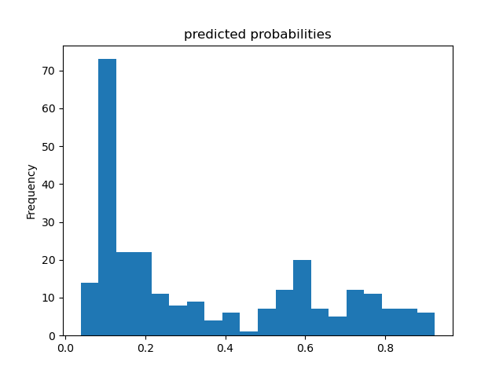
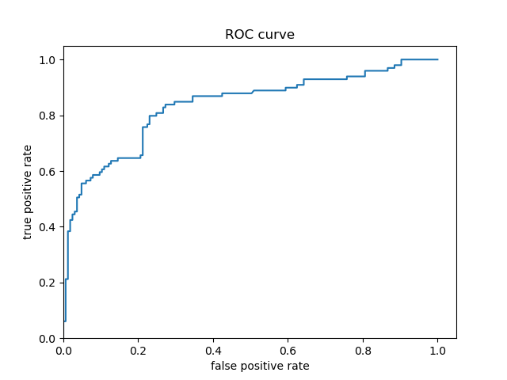

**A. Boosted Trees**

  **1. What is a one-hot-encoded column and why might it be needed when transforming a feature?  Are the source values continuous or discrete?**
  
*  A one-hot-encoded column is an indicator column that represents categorical features as a list of bytes.  It is often necessary to do so because some machine learning models require numerical values to make predictions.  Because the source feature columns were originally categorical, the source values are discrete datapoints.

  **2. What is a dense feature?  For example, if you execute example = dict(dftrain) and then tf.keras.layers.DenseFeatures(your_features)(your_object).numpy(), how has the content of your data frame been transformed?  Why might this be useful?**
  
*  A dense feature is a Keras layer that transforms the categorical feature column value into a numerical value via one-hot-encoding.  For example, running the lines of code in the question would cause all feature columns to be converted from a categorical column to a one-hot-encoded column.  Not only is this useful for the model to make predictions, as mentioned previously, but it also allows us to easily view which features are absent and where they are located by locating the zeroes in the transformed data.  This also allows us to view which features are most common and where they are located.

  **3. Provide a histogram of the probabilities for the logistic regression as well as your boosted tree model.  How do you interpret the two different models?  Are their predictions essentially the same or is there some area where they are noticeable different.  Plot the probability density function of the resulting probability predictions from the two models and use them to further illustrate your argument.  Include the ROC plot and interpret it with regard to the proportion of true to false positive rates, as well as the area under the ROC curve.  How does the measure of the AUC reflect upon the predictive power of your model?**

*  **Predicted Probability Histogram - Logistic Regression:**

  

*  **Predicted Probability Histogram - Boosted Trees:**

  

*  **Predicted Probability Density Function - Logistic Regression:**

*  **Predicted Probability Density Function - Boosted Trees:**

*  **Predicted Probability Density Function - Logistic Regression:**

  

*  **Predicted Probability Density Function - Boosted Trees:**

---
---

**B. Boosted Trees continued (with model understanding)**

  **1. Upload your feature values contribution to predicted probability horizontal bar plot as well as your violin plot.  Interpret and discuss the two plots.  Which features appear to contribute the most to the predicted probability?**

  **2. Upload at least 2 feature importance plots.  Which features are the most important in their contribution to your models predictive power?**

  **3. Stretch goal**
