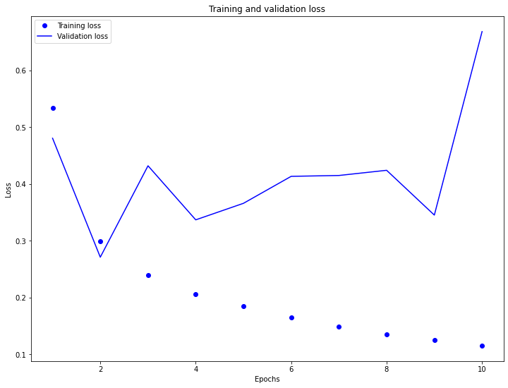
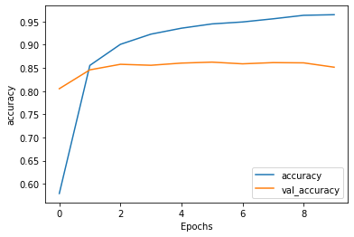

**A. Word Embeddings**

  **1. Why is using one-hot encoding an inefficient towards vectorizing a corpus of words?  How are word embeddings different?**

*   One-hot encoding is inefficient because it doesn't indicate relationships between similar words.  Word embeddings differ from one-hot encoding because the the similarity of embedding values indicate the level of similarity between words.  In other words, the closer the embedding values, the more closely-related the words are to one another.  To add onto this same point, larger datasets allow the embeddings to show more fine-tuned distinctions between words, while one-hot encoding would simply require a greater number of very long vectors (which is another contributing factor to one-hot encoding's inefficiency, as compared to word embedding).  When encoding a large corpus of words, it can be really inefficient to store the large one-hot encoding vectors. 

    Another difference between one-hot encoding and embedding is that one-hot encoding involves equating a word to a sparse vector of zeroes and ones (where the location of the '1' in the vector indicates which word is being represented), while embedding involves equating a word to a dense vector.  This dense vector contains floating point numbers that represent a given word.  Embeddings also serve as "lookup tables" that map an integer representing a word to its respective dense vector.  
    
    In addition, one-hot encoding differs from embedding because one-hot ecoding vector values are manually specified, while embedding values are parameters determined by a model.

  **2. Compile and train the model from the tensorflow exercise.  Plot the training and validation loss as well as accuracy.  Post your plots and describe them.**

* **Training and Validation Loss**

*  While the training loss is steadily decreasing, the testing/validation loss is rather unstable and is increasing, overall.  This indicates that the model is overfitting to the training data, as accuracy has an inverse relationship to the model's loss.  Consequently, the training accuracy is increasing while the testing/validation accuracy is decreasing.  Perhaps this overfit is due to the simple nature of the model.

* **Training and Validation Accuracy**

*  The plots of training and testing/validation accuracy confirm what was observed in the training and testing/validation loss plots.  The training accuracy is steadily increasing (from approximately 0.675 to about 0.95) while the testing/validation accuracy is slightly decreasing across the 10 epochs.  Interestingly, the testing accuracy was pretty stable at around 0.85, even though the testing loss was quite inconsistent.  As indicated by the plot of losses, the model is indeed overfit to the training data because the testing accuracy is almost always less than the training accuracy over time (excluding the first two epochs).  Because the overfitting may be due to the simplicity of the model, it may help to add additional Dense layers to the network to improve the testing accuracy.

**B. Text Classification with an RNN**

  **1. Again compile and train the model from the tensorflow exercise.  Plot the training and validation loss as well as accuracy.  Stack two or more LSTM layers in your model.  Post your plots and describe them.**
  
* **Initial Training and Validation Loss**

*  Prior to stacking two LSTM layers within my model, the loss steadily increased over time for the testing/validation text dataset while the loss steadily decreased for the training text dataset.  Although the testing loss generally decreased across the first two epochs, the model was still not very accurate at that time because the model was underfit.  In other words, the model had not been run long enough to even pick up on patterns in the training set.  This underfitting is also evidenced by the testing loss actually being lower than the training loss in the first epoch.  However, the model appears to be overfitting for the remainder of the epochs, as the training loss switched to being lower than the training loss from then on.

* **Initial Training and Validation Accuracy**

*  The testing/validation accuracy prior to stacking two LSTM layers was quite steady over time (at around 0.85), while the training accuracy prior to stacking two LSTM layers inreased rapidly in the first epoch and continued to steadily rise over time to just over 0.95.  It was interesting to see that the testing accuracy was so high initially, at approximately 0.80.  However, as mentioned in the description of the loss plot, the model was underfit at this time.  This underfitting can also be seen in the accuracy plots, as the training accuracy was actually lower than the testing accuracy for the first epoch.  However, after the first epoch, the model became overfit as the training accuracy quickly became higher than the testing accuracy.  It was also interesting to note that the testing accuracy was so stable over time, but it appeared to begin slightly decreasing around the eighth epoch.

* **Additional Layer Training and Validation Loss**

*  After stacking two LSTM layers within my model, the testing/validation loss not only increased more than the testing/validation loss prior to stacking two LSTM layers (the initial model increased to just under 0.5 and the second model with stacked LSTM layers increased to just over 0.55), but it also appeared to increase much more rapidly over time.  Otherwise, the losses after stacking the two LSTM layers were very similar to the losses prior to stacking the layers.  For example, both models were underfit for the first epoch and became overfit shortly thereafter.  In addition, the training loss curves both steadily decreased over time, while the testing loss curves decreased for the first epoch and then began increasing for the remaining epochs.

* **Additional Layer Training and Validation Accuracy**

*  Just as the loss curves after stacking two LSTM layers were quite similar to the original loss curves, the accuracy curves after stacking two LSTM layers were strikingly similar to the original accuracy curves.  In fact, the testing/validation accuracy curves even started at approximately the same level of accuracy at around 0.80.  Both plots also show the initial underfitting at the first epoch, where the training accuracy was less than the testing accuracy.  In addition, they also both show the overfitting shortly thereafter, as the training accuracy steadily rose higher above the testing accuracy.  Nevertheless, there were a few slight differences in the accuracy curves after stacking two LSTM layers.  The first of these is what appears to be a slightly higher testing accuracy at the intersection between the training and testing/validation curves after stacking the layers.  The second of these is that the testing accuracy curve for the model with two stacked LSTM layers appears to be decreasing across the epochs (or at least more so than in the model without stacked LSTM layers).  However, the differing intersection point may only appear to be the case due to a difference in scaling between the two plots.  Consequently, I believe the main difference was the slight decrease in testing accuracy over time after stacking two LSTM layers.  On the original model (prior to stacking), the testing accuracy appeared to be more stable over time.
