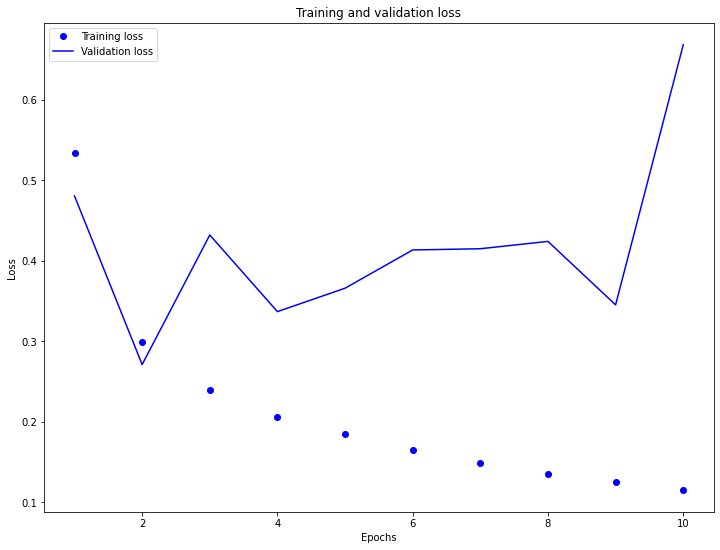
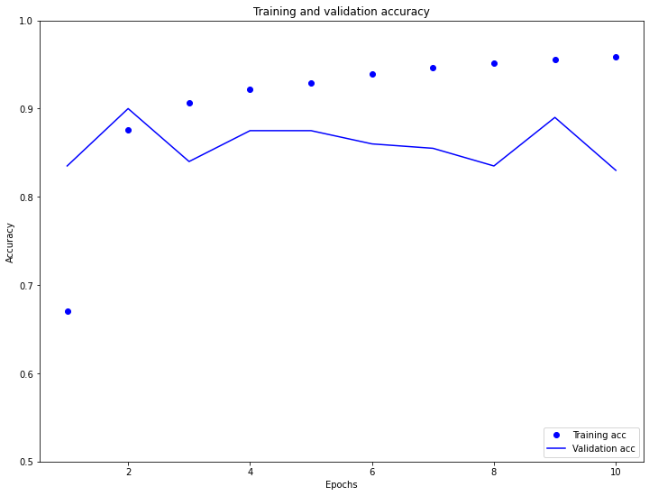
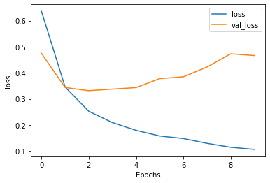
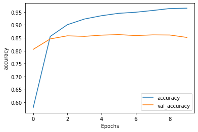
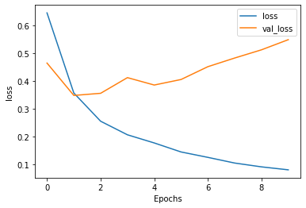
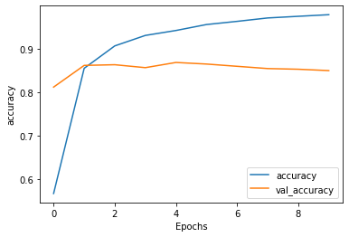

**A. Word Embeddings**

  **1. Why is using one-hot encoding an inefficient towards vectorizing a corpus of words?  How are word embeddings different?**

*   One-hot encoding is inefficient because it doesn't indicate relationships between similar words.  Word embeddings differ from one-hot encoding because the the similarity of embedding values indicate the level of similarity between words.  In other words, the closer the embedding values, the more closely-related the words are to one another.  To add onto this same point, larger datasets allow the embeddings to show more fine-tuned distinctions between words, while one-hot encoding would simply require a greater number of very long vectors (which is another contributing factor to one-hot encoding's inefficiency, as compared to word embedding).  When encoding a large corpus of words, it can be really inefficient to store the large one-hot encoding vectors. 

    Another difference between one-hot encoding and embedding is that one-hot encoding involves equating a word to a sparse vector of zeroes and ones (where the location of the '1' in the vector indicates which word is being represented), while embedding involves equating a word to a dense vector.  This dense vector contains floating point numbers that represent a given word.  Embeddings also serve as "lookup tables" that map an integer representing a word to its respective dense vector.  
    
    In addition, one-hot encoding differs from embedding because one-hot ecoding vector values are manually specified, while embedding values are parameters determined by a model.

  **2. Compile and train the model from the tensorflow exercise.  Plot the training and validation loss as well as accuracy.  Post your plots and describe them.**

* **Training and Validation Loss**

*  While the training loss is steadily decreasing, the testing/validation loss is rather unstable and is increasing, overall.  This indicates that the model is overfitting to the training data, as accuracy has an inverse relationship to the model's loss.  Consequently, the training accuracy is increasing while the testing/validation accuracy is decreasing.  Perhaps this overfit is due to the simple nature of the model.

* **Training and Validation Accuracy**

*  The plots of training and testing/validation accuracy confirm what was observed in the training and testing/validation loss plots.  The training accuracy is steadily increasing (from approximately 0.675 to about 0.95) while the testing/validation accuracy is slightly decreasing across the 10 epochs.  Interestingly, the testing accuracy was pretty stable at around 0.85, even though the testing loss was quite inconsistent.  As indicated by the plot of losses, the model is indeed overfit to the training data because the testing accuracy is almost always less than the training accuracy over time (excluding the first two epochs).  Because the overfitting may be due to the simplicity of the model, it may help to add additional Dense layers to the network to improve the testing accuracy.

**B. Text Classification with an RNN**

  **1. Again compile and train the model from the tensorflow exercise.  Plot the training and validation loss as well as accuracy.  Stack two or more LSTM layers in your model.  Post your plots and describe them.**
  
* **Initial Training and Validation Loss**

* **Initial Training and Validation Accuracy**

* **Additional Layer Training and Validation Loss**

* **Additional Layer Training and Validation Accuracy**

