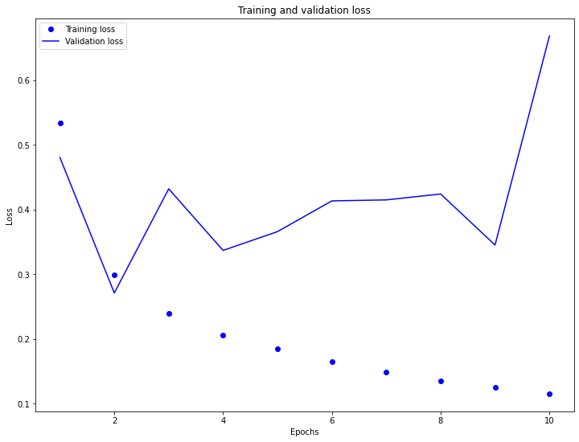

**A. Word Embeddings**

  **1. Why is using one-hot encoding an inefficient towards vectorizing a corpus of words?  How are word embeddings different?**

*   One-hot encoding is inefficient because it doesn't indicate relationships between similar words.  Word embeddings differ from one-hot encoding because the the similarity of embedding values indicate the level of similarity between words.  In other words, the closer the embedding values, the more closely-related the words are to one another.  To add onto this same point, larger datasets allow the embeddings to show more fine-tuned distinctions between words, while one-hot encoding would simply require a greater number of very long vectors (which is another contributing factor to one-hot encoding's inefficiency, as compared to word embedding).  When encoding a large corpus of words, it can be really inefficient to store the large one-hot encoding vectors. 

    Another difference between one-hot encoding and embedding is that one-hot encoding involves equating a word to a sparse vector of zeroes and ones (where the location of the '1' in the vector indicates which word is being represented), while embedding involves equating a word to a dense vector.  This dense vector contains floating point numbers that represent a given word.  
    
    In addition, one-hot encoding differs from embedding because one-hot ecoding vector values are manually specified, while embedding values are parameters determined by a model.

  **2. Compile and train the model from the tensorflow exercise.  Plot the training and validation loss as well as accuracy.  Post your plots and describe them.**

* **Training and Validation Loss**

* **Training and Validation Accuracy**

  **3. Stretch Goal:  Follow the link to the Embedding Projector provided at the end of the exercise.  Produce the visualization of your embeddings.  Interpret your visualization.  What is it describing?  Is there relevance with regard to words that are proximate to each other?**

**B. Text Classification with an RNN**

  **1. Again compile and train the model from the tensorflow exercise.  Plot the training and validation loss as well as accuracy.  Stack two or more LSTM layers in your model.  Post your plots and describe them.**
  
* **Initial Training and Validation Loss**

* **Initial Training and Validation Accuracy**

* **Additional Layer Training and Validation Loss**

* **Additional Layer Training and Validation Accuracy**

