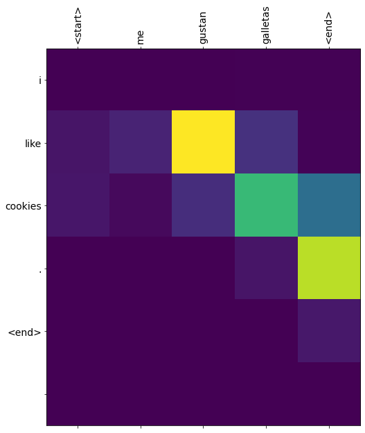
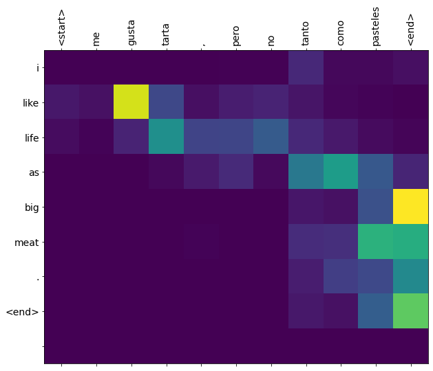

**A. Using NLP to build a sarcasm classifier**
  
  **1. Pick two or three news sources and select a few news titles from their feed (about 5 is likely enough).  For example you could select CNN, Fox News, MSNBC, NPR, PBS, Al Jazeera, RT (Russia Today), Deutsche Welle, Facebook, BBC, France24, CCTV, NHK World or another source you wish you analyze.  Run your sarcasm model to predict whether the titles are interpreted as sarcastic or not.  Analyze the results and comment on the different news sources you have selected.**
  
* I decided to try out news titles from a range of political viewpoints, so I selected five titles each from MSNBC (more liberal), Fox News (more conservative), and PBS (more independent).  I then decided to try out another set of five titles from a satirical news source, The Onion, to see how accurate the model would be on titles I knew were meant to be sarcastic.   (I will be adding more detail shortly).
  
**B. Text generation with an RNN**

  **1. Use the generate_text() command at the end of the exercise to produce synthetic output from your RNN model.  Run it a second time and review the output.  How has your RNN model been able to “learn” and “remember” the shakespeare text in order to reproduce a similar output?**
  
*  Aside from using "Romeo: " as the output starter in the TensorFlow link exercise, I also used "Juliet: " and "Benvolio: " to continue with the Romeo & Juliet theme.  (I will be adding more detail shortly).  I have attached the corresponding generated scripts below. 

* **Juliet:** 
JULIET: 'tis wonterful wom
Of transforth, my lord are green-lands!
Come, you must not on us. Show, my lord;
That he aids me his constant to thy mastal slanders.
Could you have had none on the man gof as tod
Warwick something straight,
I'll go some pursuit a scorn, till we
her his money o' the hargement, to stay myself?

JULIET:
O God--hollow, yout more friends,'Banciend of her friar, a city fair,
And lead no man bulied at against the soke of any liberty.
Why, what is resoly at all?
LAUD afteryou foutt; and, sir, are in devil:
Whus he atress your exclaiment makes thee means,
As will the king's right on 'True me past.

LEONTES:
God-den thou tread me, madam; you mar;
For thou goodfrignstant Isal:
My father he come to thee in her too;
When you his remiesand are mine.

GLOUCESTER:
'Tway to accusay my gates barnand esteet,
she believe thy words: and let me may command
us well in those untoo and unfest;
Begid thee not so sorry and proser them;
By her confessed with the dispass to execute.
What whith 

* **Benvolio:**
BENVOLIO: leave your gates,
Prepost: my wisdom for him, friar,
Or, as the glasses with thee my incomfincency
Was in theirs; forswers to seek the wolf
As dined for med at his neck.
Ah, without tooth.
Do, greater hence, and know my seas illd I no more.
His trainors!

PROSPERO:
Speal as I have no struck, bastarding.
These only sen about him? and to thy wifes by saint,
And a joir complebers can doth rough to
hanged well unsatiest joys,
And dress your daughter, friar Launt careful business
should concease me, as I see the office.

PERDITA:
A strange thousand Tybresictry, and not am I tremble
with sil
Ty attendany all aloom; friends upon
him here he not open again, thou art ancient'd
Take his child from thou canst down it were,
And make her disposition.
Will you not then, my ground back;
And with all right
And pass you tell. Pray violent do not use to fain,
Fear not till your sod will be gone.

GREMIO:
And in good son Prove, it granterform.

MENENIUS:
Very truth,--O foul time--
With these your heads, 
  
**C. Neural machine translation with attention**

  **1. Use the translate() command at the end of the exercise to translate three sentences from Spanish to English.  How did your translations turn out?**
  
* Coincidentally, like the example from the TensorFlow link, the first two sentences I selected were correctly translated and the last sentence was incorrect.  The first sentence I used was "Me gustan galletas," which the program correctly translated to "I like cookies."  On a similar note related to sweets, I then used "También me gustan pasteles," which was also correctly translated to "I also like cake."  Lastly, I used "Me gusta tarta, pero no tanto como pasteles."  This should have translated to something similar to "I like pie, but not as much as cake."  However, it instead was very incorrectly translated to "I like life as big meat."  It was also quite interesting to see the attention plot created for this final sentecne, as it was longer than the other two or the example sentences from the TensorFlow article, so there was more activity that could be seen. (I will be adding more detail soon.)  

