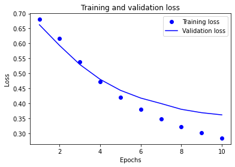
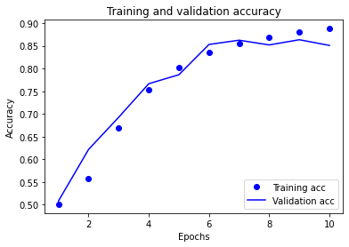

**1. What is TF Hub?  How did you use it when creating your script for “text classification of movie reviews”?**
*   TF Hub is a library in TensorFlow that allows for the reusability of machine learning models.  This reuse is useful in transfer learning, which involves training models on a smaller segment of the data and reusing the information gathered from this training to not only improve upon the current model, but also to apply this to another similar problem.  The concept of transfer learning is similar to the concept of learning how to run.  You first start small by learning how to crawl, then you gradually build on this knowledge to learn how to walk, and then you gradually build on this knowledge to gain more and more speed until you're running.  I used TF Hub when creating my script to classify text frpm IMDB movie reviews by building a neural network with a pre-trained text embedding model in the first layer of the network.  This pre-trained text embedding model (google/tf2-preview/gnews-swivel-20dim/1) has a set embedding size equal to (# of examples, 20 dimensions), and also handles preprocessing of the text data by splitting the input at blank spaces.  Plus, it comes with the added advantage of transfer learning.  It was specifically used to embed the text from the movie reviews by splitting the sentence into individual embedded tokens, which were then combined into one embedded sentence.

**2. What are the optimizer and loss functions?  How good was your “text classification of movie reviews” model?**
*   Similar to my model for clothing classification from July 8, this model for movie review text classification utilizes the "adam" optimizer function.  I attached a link to an article that does a nice job explaining this function in futher detail in the response from July 8, but the "adam" optimizer operates by adapting the model's learning rate.  My model for text classification of movie reviews uses the "binary_crossentropy" loss function to minimize the distance between the probability distributions of the actual classifications and the predicted classifications.  By selecting a binary loss function, I am seeking to classify the movie reviews' text as one of two options - either positive or negative.  As such, the "binary_crossentropy" loss function will seek to minimize the distance between the probability that a movie review is actually positive or negative and the model's confidence that the movie review is positive or negative.  This website also gives a helpful description of this particular loss function: https://towardsdatascience.com/understanding-binary-cross-entropy-log-loss-a-visual-explanation-a3ac6025181a. 

*   My model for the text classification of movie reviews did quite well, with a rather high classification accuracy of approximately 0.85 and a rather low loss of approximately 0.32.  However, the model could be better, because a lower loss indicates more accurate predictions.

**3. In “text classification with preprocessed text” you produced a graph of training and validation loss.  Add the graph to this response and provide a brief explanation.**

**4.Likewise do the same for the training and validation accuracy graph.**

