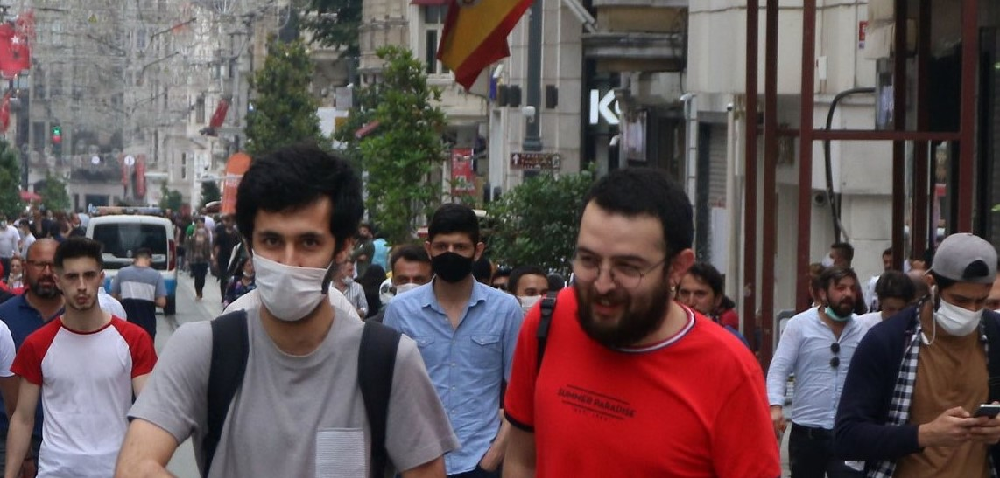
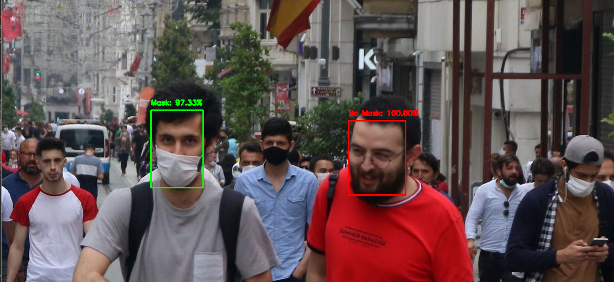

   *For this week's project, I implemented a social distance detector with two different videos of people walking in large crowds - one taken from a bird's eye view and one taken from the horizon.  I have attached these videos below, along with their respective output videos. In the repository, the bird's eye view is saved as "PeopleWalkingFromAbove.mp4" and the horizon view is saved as "CrowdOfPeople.mp4".  Their respective outputs are saved as "PeopleWalkingFromAboveOutput.avi" and "CrowdOfPeopleOutput.mp4".  "CrowdOfPeopleOutput.mp4" is slightly shorter (with a duration of 10 seconds) than the video below (with a duration of 16 seconds) because of the large file size.*

**1. Was your social distance detector effective at detecting potential violations?**

**2. Do you think this approach would be effective for estimating new infections in real time?  How would you implement such an approach in response to the COVID-19 pandemic we are currently experiencing?**

**3. What limitations or improvements might you include in order to improve your proposed design?**

***
---

   *After accomplishing this task, I also decided to implement a mask detector using the image below.  The detector very confidently assessed that the man to right is not wearing a mask - in fact, it predicted with 100% confidence that there wasn't a mask on his face.  The detector was also very confident in its prediction that the man to the left is wearing a mask.  However, it was approximately 2.67% less confident in this prediction than in its prediction for the man to the right.  Perhaps this slight decrease in confidence is due to the fact that the man on the left's mask is slightly crooked and is not fully covering his nose.  Another direction to take with this face mask detector would be to adjust for different positions of the mask and to be able to detect masks on people outside of the foreground of the images provided.*

  

***
---

   *I then decided to implement the face mask detector with a video stream.  I provided the detector with a video of a man putting on a face mask as input and it was mostly accurate in its predictions - both when the man was and wasn't wearing a mask.  In fact, it was completely accurate when the man had not yet put on a face mask at the beginning of the video, and also when the man had finished putting on a face mask at the end of the video.  The mask detector was approximately 98% confident in its prediction that the man wasn't wearing a mask in the beginning, and around 96% confident in its prediction that he was wearing a mask at the end of the video.  I have attached both the input and output videos below.  They are saved in the repository as "wearing_mask.mp4" and "wearing_mask_output.avi", respectively.*  

   *The only time I found that the face mask detector was inaccurate in its prediction was when the man was first putting his face mask on.  At the 1 second mark of the output video, when the mask is stretched out to place the straps on his ears, the detector is approximately 75% confident that the man is not wearing a mask, even though his mouth and nose are covered.  While the detector wasn't very highly confident in this decision, indicating that it realized it may have been incorrect, it may have mistakenly predicted he was not wearing a mask because it was not conformed to his face shape.  This error could also have occurred because the mask was not yet positioned very high up on his face, causing some of his nose and the area below his eyes to be uncovered.*  

   *Shortly after this initial error, while the mask was still being placed on his face, another error in the detector's prediction occurred.  Similar to the first error, the detector likely falsely predicted he was not wearing a mask because it was still stretched out and did not yet conform to the shape of his face.  This time, however, the face mask detector was less sure of its prediction that he was not wearing a mask, at only about 56% confidence.*    

**Do you think implementing a face mask detector could add value to a social distancing detector?**
