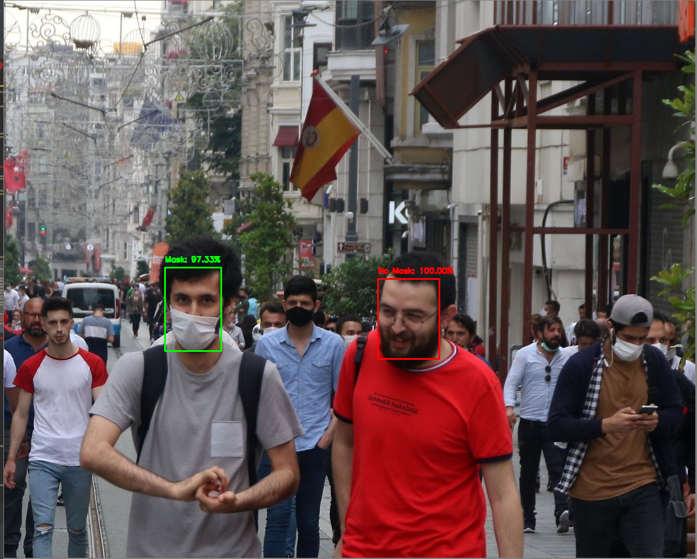

For this week's project, I implemented a social distance detector with two different videos - one taken from a bird's eye view and one taken from the horizon.  Due to the large video sizes, the videos have trouble rendering on this page, but the output corresponding to the bird's eye view is saved as my_output.avi and the output for the horizon angle is saved as my_second_output.avi in the repository.

**1. Was your social distance detector effective at detecting potential violations?**

**2. Do you think this approach would be effective for estimating new infections in real time?  How would you implement such an approach in response to the COVID-19 pandemic we are currently experiencing?**

**3. What limitations or improvements might you include in order to improve your proposed design?**

After accomplishing this task, I also decided to implement a mask detector using an image that depicts a man, who is wearing a mask, walking with another man who is not wearing a mask.

![](people-wearing-not-wearing-masks.jpg]

**Do you think implementing a face mask detector could add value to a social distancing detector?**
