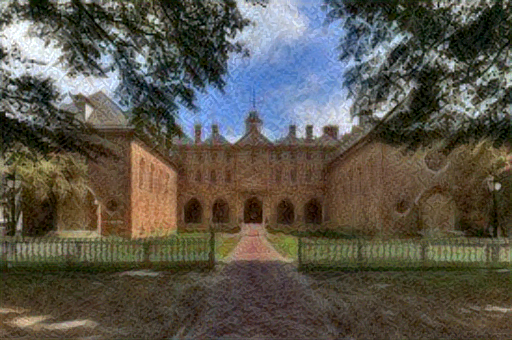
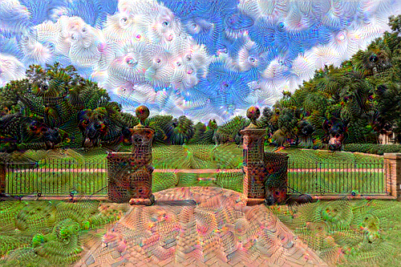
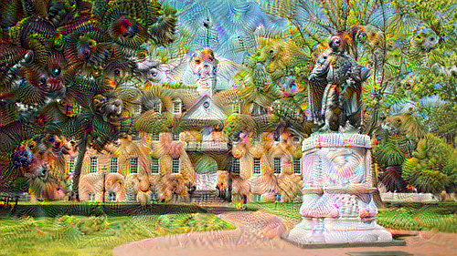
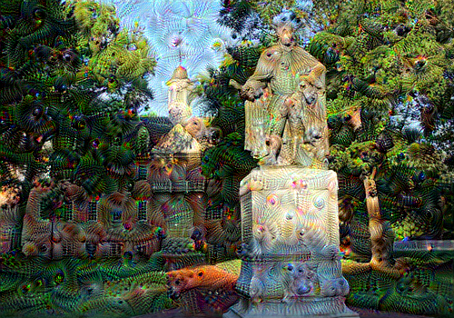
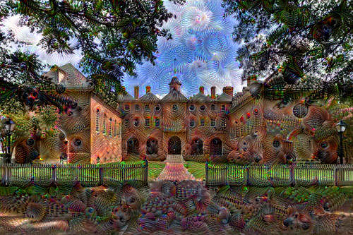
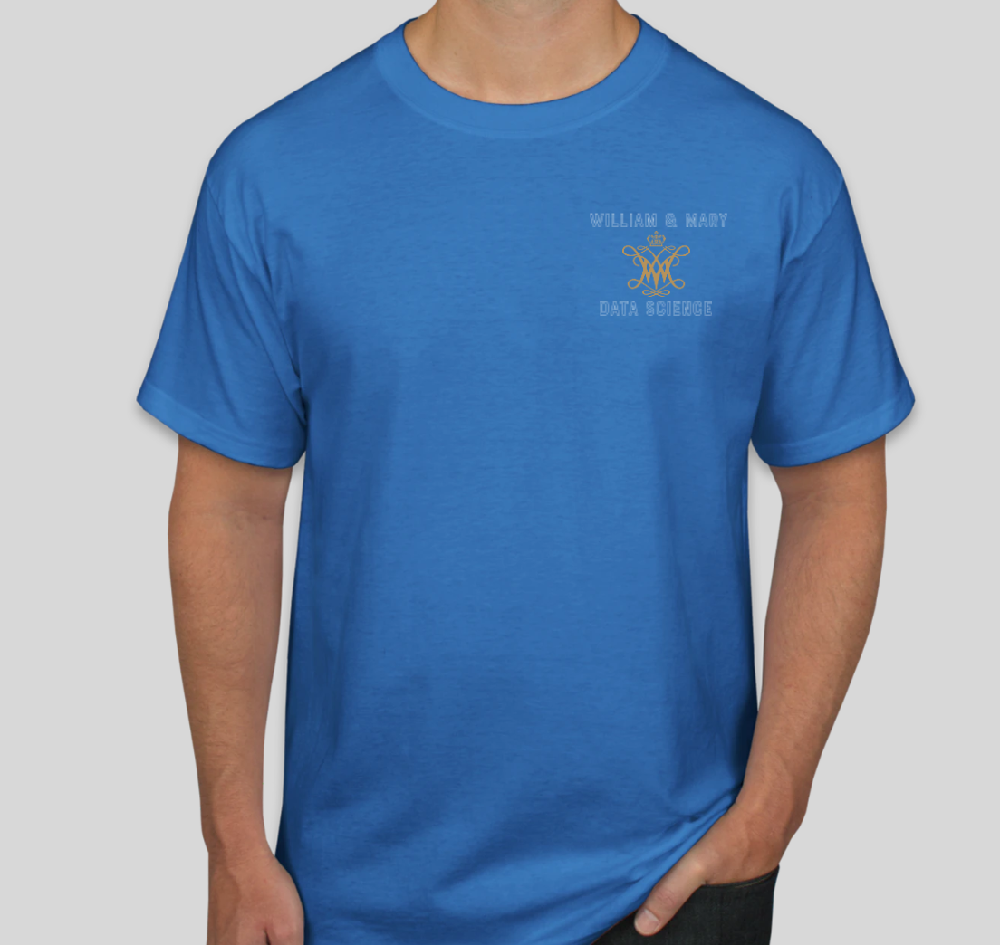
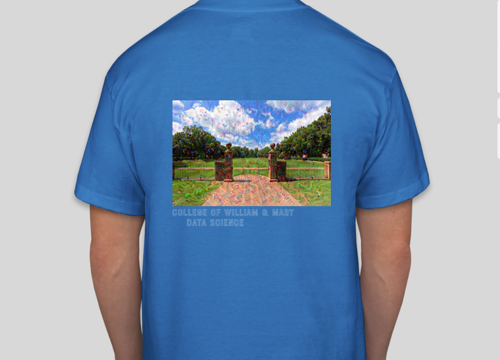

Working on this project, I decided to take inspiration from William & Mary's beautiful campus.  I applied several different patterns and colors to style pictures of various landmarks across campus, but ultimately I found a picture of a tile backsplash that created what looked like a water color painting of the Wren building.  I have attached it below.

I then tried applying this same tile pattern to a picture of the Sunken Garden.  However, it looked a little grainy afterwards and didn't create quite the same impact as the Wren building.  Still, I thought the image I had found of the Sunken Garden was really pretty, especially with the large, fluffy clouds in the sky. So I then decided to apply the DeepDream neural network implementation.  I think it really brought out the colors of the Sunken Garden and I have attached the results below.  I thought having the DeepDream implementation place eyes in the clouds was a perfect metaphor because William & Mary is where I "see" my "dreams" coming true. 

Since the DeepDream implementation worked out so well on the picture of the Sunken Garden, I also tried applying it to various images of the Wren building.  I have attached these below, as well.  I think these turned out really well too, and I especially like how they look mystical.

For my T-shirt contest entry, I would like to place the first DeepDream picture of the Sunken Garden on the back of the shirt and the William & Mary seal as the crest on the front of the shirt.

   
