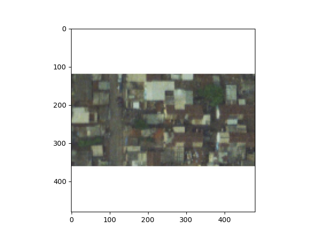

# Project 3 - Part 2

## Making Predictions on Randomly-Selected Images

First, I decided to test my model's predictive power on a picture that I believed looked to be densely populated.  According to the population data from the .csv file of population labels, there are approximately 116 people living in this region.  I would agree with this estimate, as practically the entire image is filled with housing structures.  I have attached the picture below (7892.jpeg).  However, my model predicted there to be only about 14 people living in the area.  Perhaps this was due to the large amount of white space seen in the plot of the image below.  To try to improve the model, I refit the model using arguments for the epochs and steps per epoch that were more similar to what we discussed in class today.  (I will be updating the page shortly with the improvements this led to).

Next, I tested my model's predictive power on a picture of an open field, where there didn't seem to be any population.  This time, the model predicted there to be about 12 people living in the area, but the population data in the .csv file stated that there are approximately 114 people.  Consequently, I believe my model was actually more accurate than the population labels dataset, as there doesn't appear to be any sign of civilization in this picture.  I think that the predictions made to yield the population labels in the .csv file may have been inaccurate because of the large amount of white space, similar to the populated image plot from above.  It may also be due to the fact that many of the images surrounding this picture (i.e., files between 7817.jpeg and 7900 jpeg) depict regions that are highly populated.  Since these pictures were likely taken in the same general area, the model that produced the .csv file data may have assumed the files that fell into this range all contained highly-populated images.

